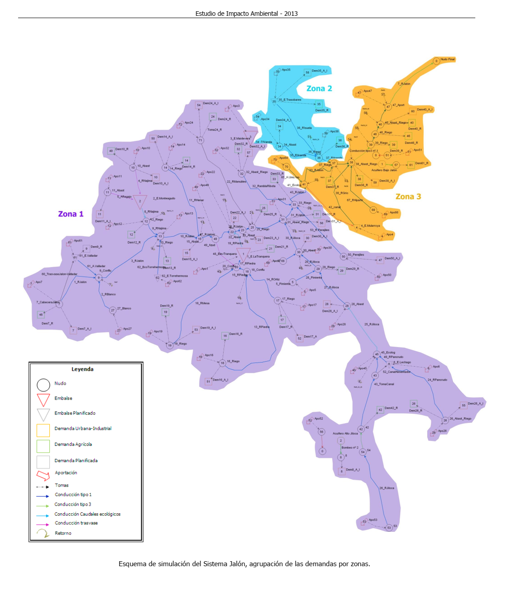

<!-->Luis Tirado Blázquez
	
15:02 (hace 1 hora)
	
para mí
Hola Jesús que tal, te he enviado un wetransfer con todos los expedientes de Mularroya, necesito super urgentemente cualquier alusión que se haga sobre los regadíos, como el municipio, la superficie, cualquier cosa vale. Es para el recurso de casación que estamos preparando y que tiene como fecha límite el 30 es decir el viernes,...

Si encuentras algo me extraes el documento que es y un pdf con la página concreta donde nombran los regadíos.
</-->
# ANÁLISIS EXPEDIENTE MULARROYA Relación general de documentos a examen
d-----        28/01/2025     16:17     `Adenda 2016`
d-----        28/01/2025     16:17     Alegaciones dic 2013 [NOK]
d-----        28/01/2025     16:17     `Demanda 2018`
d-----        28/01/2025     16:17     `EIA 2013 Mularroya`
d-----        28/01/2025     16:17     Recurso 2015 [NOK]
## -a----        28/01/2025     16:17     1123551 Alegaciones Adenda Presa Mularroya2 (1).docx
*Uno de los objetivos fundamentales de este proyecto es la consolidación de regadíos actuales y la transformación de nuevas superficies. `Estas transformaciones están pendientes de ser definidas y evaluadas social, económica y ambientalmente, con lo que carece de todo sentido seguir adelante con su tramitación de este proyecto hasta, por lo menos, no estar totalmente resuelto el destino de las aguas que se pretende regular y su impacto ambiental acumulado`* p.6
-a----        28/01/2025     16:17     56320 carta expediente mularroya evaluacion.doc [NOK]

-a----        28/01/2025     16:17     816200 contestMº_CalidadyEvaluacionAmbiental.pdf [NOK]

## -a----        28/01/2025     16:17    1320503 INFORME_DE_SOSTENIBILIDAD_AMBIENTAL_CAMPO_DE_CARINENA.pdf 
*Aspecto
ambiental
Criterio ambiental Indicador
• Nº de municipios afectados dentro de la Red Natura
2000/ENPs
• Nº y superficies de riego modernizadas en Red Natura
2000/ENPs*  PLAN DE ZONA DE DESARROLLO RURAL SOSTENIBLE DE
LA COMARCA DE CAMPO DE CARIÑENA
INFORME DE SOSTENIBILIDAD AMBIENTAL
Enero de 2011 p.94

## -a----        28/01/2025     16:17    1342670 Informe_Foro_Técnico_Mularroya_FINAL.pdf
*aforos disponibles en la estación de Chodes, aguas abajo del azud de derivación para Mularroya. Aunque hay tan sólo aforos de 10 años, la ventaja que ofrece esta estación radica en que se ubica aguas abajo, después de haberse producido las derivaciones de caudal para riego de cuatro acequias. Aunque no son todas las que hay entre el azud y la desembocadura del Grío, cuyas detracciones deben priorizarse frente a los caudales trasvasables a Mularroya, al menos quedará descontada una parte de esos caudales de riego* p.4

*Es de notar que el volumen útil del embalse será menor (cuando menos 3 hm3 menos), ya que habría que descontar el volumen muerto del embalse. Además habría que descontar un volumen evaporado cuando menos del 12% del total, unos 6 hm3. Por otro lado, como antes se ha explicado, deberían restarse los caudales de riego comprometidos entre Chodes y la desembocadura del Grío*
...
*haciendo una estimación conservadora, estos 5 factores – evaporación, embalse muerto, caudales de riego no descontados, incidencia del cambio climático y tasa de interanualidad en la regulación - sumarán cuando menos 12 hm3, con lo que el volumen de regulación medio anual será de unos 50 hm3, menos del 50% de la capacidad del embalse* p.5

*teniendo en cuenta que la tradición administrativa
quintuplica el canon urbano respecto al de riego, y que los usos urbanos suponen en torno a 9
hm3/año, los vecinos de la cuenca verían subir su factura del agua con un canon añadido
equivalente al de 45 millones de m3 de riego, con los que podrían regarse casi 7000 ha. Por ello,
aunque el volumen usado para el abastecimiento urbano en los pueblos y ciudades de la
cuenca sea pequeño, la parte del canon que aumentaría la factura del agua de los vecinos, de
forma injusta, puede ser significativa. En cuanto al regadío, el aumento que podría suponer este
canon en toda la cuenca sería de 152 €/ha el primer año; y 139 €/ha/año a lo largo de la década
siguiente* p.6 

-a----        28/01/2025     16:17      19516 
INICIATIVA PARLAMENTARIA-Mularroya LT.docx
-a----        28/01/2025     16:17    2241936 resolución impacto ambiental Mularroya 19-5-2015.pdf
-a----        28/01/2025     16:17      25088 Revisión del Plan Hidrológico del Jalón.doc
-a----        28/01/2025     16:17      95484 SEN 5-2-13.docx
-a----        28/01/2025     16:17    3063901 Sentencia Mularroya.tif

## Adenda 2016
-a----        28/01/2025     16:17          15754 20160317_Jalón_info.docx
-a----        28/01/2025     16:17        1123551 Alegaciones Adenda Presa Mularroya2 (1).docx NOK
-a----        28/01/2025     16:17        4043438 P1060440.JPG mejora perdicera/conejo
-a----        28/01/2025     16:17        3747902 P1060441.JPG mejora perdicera/perdiz
-a----        28/01/2025     16:17        4172569 P1060442.JPG Nuevas ZEPAs
-a----        28/01/2025     16:17        4406725 P1060443.JPG Balsas
-a----        28/01/2025     16:17        3966369 P1060444.JPG Seguimiento / Cuevas
-a----        28/01/2025     16:17        4414353 P1060445.JPG Jalonado
-a----        28/01/2025     16:17        4180375 P1060446.JPG Maquinaria
-a----        28/01/2025     16:17        4115477 P1060447.JPG Protec. aire
-a----        28/01/2025     16:17        4425955 P1060448.JPG Ruido
-a----        28/01/2025     16:17        4138816 P1060449.JPG Ruido/2
-a----        28/01/2025     16:17        4178920 P1060450.JPG Ruidos/3
-a----        28/01/2025     16:17        4117632 P1060454.JPG Vertidos
-a----        28/01/2025     16:17        4118523 P1060455.JPG Polvo
-a----        28/01/2025     16:17        4107033 P1060456.JPG Ruido
-a----        28/01/2025     16:17        4093563 P1060461.JPG Afección especies
-a----        28/01/2025     16:17        4117980 P1060462.JPG "Marcaje de ejemplares de águila perdicera"
-a----        28/01/2025     16:17        4099247 P1060463.JPG Afecciones DP
-a----        28/01/2025     16:17        4036776 P1060464.JPG Medidas fase explotación / residuos
-a----        28/01/2025     16:17        4079486 P1060465.JPG Seguimiento plantaciones
-a----        28/01/2025     16:17        4089207 P1060466.JPG Peces

## EIA 2013 Mularroya
d-----        28/01/2025     16:17          Estudio Impacto Ambiental Ya analizado en T1 a T5
-a----        28/01/2025     16:17          68736 alegaciones  EIA mularroya COAGRET 2013.docx
-a----        28/01/2025     16:17          36302 Alegación Mularrolla [sic] SEO-BirdLife Agol13.docx [NOK]
-a----        28/01/2025     16:17          40381 Alegación Mularroya SEO-BirdLife Agol13.docx [NOK]
-a----        28/01/2025     16:17          95007 SENTENCIA 5-2-13.docx
[NOK]

### -a----        28/01/2025     16:17      119716416 T1.pdf Regadíos/Regadío  [NOK] *"Esta presa cumpliría con los objetivos fijados para el proyecto, regulando la cuenca de manera adecuada y garantizando un suministro suficiente de agua para los regadíos y las demandas urbanas e industriales de agua, garantizando una superficie de riego de 26.340 Ha"* p.95

*Contaría además con tomas de riego para servir agua a las huertas que se encuentran aguas abajo y una escala para peces* 98

*4.2.3.2.3 Tomas Las tomas para riego se sitúan en el bloque del azud situado al estribo izquierdo del mismo. Son dos y consisten en dos orificios rectangulares que atraviesan el azud. Las dimensiones del orificio son 2,00 m de anchura por 0,796 m de altura. La estructura de embocadura de la toma sobresale del paramento aguas arriba del azud 4,069 m, tiene perfiles redondeados para evitar cavitaciones y consta de una reja de desbaste y un nicho para el ataguiado provisional. Aguas abajo se proyectan sendas compuertas de regulación (de sector) y un canal de descarga de 8,066 m de anchura y 40,00 m de longitud. Este canal está limitado por el muro del cuenco del aliviadero y por el estribo de la margen izquierda. Las tomas se han diseñado para poder dar prioridad al riego del Jalón, evitando en lo posible la recirculación innecesaria de caudales desde el Jalón al embalse y desde éste de nuevo al Jalón, asegurando por un lado el caudal ecológico en el río Jalón aguas abajo del azud y por otro lado evitando el depósito de sedimentos en el embalse de presa* p.98

*4.4.1.2 Repercusiones de no seguir la ejecución de las obras. Las principales repercusiones que tendría no hacer nada más de la obra son:*

*4.4.1.2.1 Económicas:*
*- Perjuicios económicos en la zona regable del Bajo Jalón por no poder garantizar los riegos, objetivo fundamental del proyecto. El Sindicato Central de Usuarios del Jalón tiene valorado el importe que supone cada mes de demora en la finalización de la obra en 1.308.333,33 €. (valoración del año 2009)*
*- Perjuicios económicos de interés general, derivados de la imposibilidad de asegurar un régimen de caudales ecológicos y laminación de avenidas que puedan afectar a las poblaciones ribereñas.*
*- Gastos producidos por rescisión del contrato del Contratista de la obra y del contrato de la Asistencia Técnica de control y vigilancia.*
*- Importe “perdido” de la obra ya ejecutada y de los trabajos de Asistencia Técnica a la Dirección de Obra (algo más de 50 millones de euros)*
*- Importe “perdido” pagado por expropiaciones (algo más de 11 millones de euros)*
*- Importe de las obras de acondicionamiento necesarias para la adecuación del entorno a causa de la no continuación de las obras (retirada de ataguía, reposición del cauce río Grío, reposición de infraestructuras,restauraciones ambientales, etc...)* p.115

### -a----        28/01/2025     16:17       35749722 T2.pdf

El objeto principal del embalse es el mantenimiento de los regadíos del bajo Jalón,
lo que se estima supone unas necesidades de agua de 9.319 m3/ha y año, por lo que
la superficie regable tras la regulación supondrá un total de 26.340 ha de los siguientes
términos municipales: Alagón, Alcalá, Alfamén, Almonacid, La Almunia de Doña
Godina, Alpartir, Bárboles, Bardalluer, Cabañas de Ebro, Calatorao, Cariñena,
Consuenda, Chodes, Epila, Figueruelas, Grisén, La Joyosa, Lucena, Luceni, Lumpiaque,
Pedrola, Pinseque, Plasencia, Pleitas, Ricla, Rueda, Salillas, Sobradiel, Torres de
Berellén, Urrea, Utebo y Zaragoza.
En resumen, la realización del proyecto al finalizar las obras tendrá efectos
socioeconómicos positivos en la zona al favorecer el empleo directo e indirecto por la
consolidación de 21.340 Ha de regadío y la transformación de 5.000 Ha de secano a
regadío, a lo que hay que sumar los puestos de trabajo necesarios para la ejecución de
las obras.
 p.28

 Para establecer la asignación y reserva de los recursos disponibles para las
demandas previsibles en un horizonte futuro, se emplea la serie corta (1980/81-
2005/06). La aportación anual (escorrentía) en régimen natural promedio del
Sistema Jalón para la serie corta es de 457,62 hm3/año, dato obtenido del Anejo VI.
Sistemas de Explotación y Balances, de la propuesta del Proyecto del Plan
Hidrológico de la Cuenca del Ebro (en adelante propuesta del Proyecto PHE). p.40

En el bajo Jalón, aguas abajo del embalse, la puesta en funcionamiento
de Mularroya permite una consolidación de los regadíos de la zona,
mejorando la satisfacción de las demandas. Sin embargo, no se logra alcanzar los niveles de garantía establecidos en la IPH, dado que el déficit
máximo en diez años consecutivos se encuentra por encima del 100%.
No obstante, este déficit se consigue reducir en aproximadamente un
48% respecto a la situación actual. p.69

El objeto principal del embalse es el mantenimiento de los regadíos del bajo Jalón,
lo que se estima supone unas necesidades de agua de 9.319 m3/Ha y año, por lo que,
la superficie regable tras la regulación supondrá un total de 26.340 ha de los siguientes
términos municipales: Alagón, Alcalá, Alfamén, Almonacid, La Almunia de Doña
Godina, Alpartir, Bárboles, Bardalluer, Cabañas de Ebro, Calatorao, Cariñena,
Consuenda, Chodes, Epila, Figueruelas, Grisén, La Joyosa, Lucena, Luceni, Lumpiaque,
Pedrola, Pinseque, Plasencia, Pleitas, Ricla, Rueda, Salillas, Sobradiel, Torres de
Berellén, Urrea, Utebo y Zaragoza. 

La realización del proyecto al finalizar las obras tendrá efectos socioeconómicos
positivos en la zona, al favorecer el empleo directo e indirecto por la consolidación de
21.340 Ha y la transformación de 5.000 Ha de secano a regadíos. Desde el punto de
vista de viabilidad de la producción agrícola, el cultivo actual ve mermado su desarrollo
por la falta de una dotación suficiente y de garantía de la misma, por lo que la mejora
de los regadíos existentes y la implantación de otros nuevos favorecerá una
consolidación y estabilidad del sector agrícola y se favorecerá una mejora de la
seguridad, diversidad y calidad de las cosechas, por lo que, la zona alcanzará un mayor
nivel de desarrollo y una mejora de la calidad de vida.

p.201

### -a----        28/01/2025     16:17       86214911 T3.pdf
El objeto principal del embalse es el mantenimiento de los regadíos del bajo
Jalón, lo que se estima supone unas necesidades de agua de 9.319 m3/ha y año,
por lo que la superficie regable tras la regulación supondrá un total de 26.340 ha de
los siguientes términos municipales: Alagón, Alcalá, Alfamén, Almonacid, La Almunia
de Doña Godina, Alpartir, Bárboles, Bardalluer, Cabañas de Ebro, Calatorao,
Cariñena, Consuenda, Chodes, Epila, Figueruelas, Grisén, La Joyosa, Lucena,
Luceni, Lumpiaque, Pedrola, Pinseque, Plasencia, Pleitas, Ricla, Rueda, Salillas,
Sobradiel, Torres de Berellén, Urrea, Utebo y Zaragoza.
En resumen, la realización del proyecto al finalizar las obras tendrá efectos
socioeconómicos positivos en la zona al favorecer el empleo directo e indirecto por
la consolidación de 21.340 has y la transformación de 5.000 has de secano a
regadíos, a lo que hay que sumar los puestos de trabajo necesarios durante la
ejecución de las obras. p.5 [se repite en p. 79]

Esta presa cumpliría con los objetivos fijados para el proyecto, regulando la
cuenca de manera adecuada y garantizando un suministro suficiente de agua para
los regadíos y las demandas urbanas e industriales de agua, garantizando una
superficie de riego de 26.340 Ha. p.64

Es evidente que el conjunto de obras del proyecto tienen como objetivo el
mantenimiento de los regadíos del bajo Jalón, lo que se estima supone unas
necesidades de agua de 9.319 m3/ha y año, por lo que la superficie regable tras la regulación supondrá un total de 26.340 ha de los siguientes términos municipales:
Alagón, Alcalá, Alfamén, Almonacid, La Almunia de Doña Godina, Alpartir, Bárboles, Bardalluer, Cabañas de Ebro, Calatorao, Cariñena, Consuenda, Chodes, Epila, Figueruelas, Grisén, La Joyosa, Lucena, Luceni, Lumpiaque, Pedrola, Pinseque, Plasencia, Pleitas, Ricla, Rueda, Salillas, Sobradiel, Torres de Berellén, Urrea, Utebo y Zaragoza. p.84 

`Período 1988/89-92/93: afecta a toda la cuenca del Ebro en mayor o menor medida, se trata del ciclo de mayor duración. El sistema Jalón fue uno de los más afectadas por la sequía en este período con coeficientes de variabilidad de aportaciones entorno 55-80 %.`
- `Período 1994/95-95/96: afecta a toda la cuenca del Ebro en mayor o menor medida`
- `Período 1998/99-99/00: afecta prácticamente a toda la cuenca del Ebro en mayor o menor medida`
- `Período 2001/02: año de sequía hidrológica extrema` p.254

no se logra alcanzar los
niveles de garantía establecidos en la IPH, dado que el déficit máximo en
diez años consecutivos se encuentra por encima del 100%. No obstante,
este déficit se consigue reducir en aproximadamente un 48% respecto a la
situación actual. p.255

El objeto principal del embalse es el mantenimiento de los regadíos del bajo Jalón,
lo que se estima supone unas necesidades de agua de 9.319 m3/Ha y año, por lo que,
la superficie regable tras la regulación supondrá un total de 26.340 ha de los siguientes
términos municipales: Alagón, Alcalá, Alfamén, Almonacid, La Almunia de Doña
Godina, Alpartir, Bárboles, Bardalluer, Cabañas de Ebro, Calatorao, Cariñena,
Consuenda, Chodes, Epila, Figueruelas, Grisén, La Joyosa, Lucena, Luceni, Lumpiaque,
Pedrola, Pinseque, Plasencia, Pleitas, Ricla, Rueda, Salillas, Sobradiel, Torres de
Berellén, Urrea, Utebo y Zaragoza. p.342

### -a----        28/01/2025     16:17       93390031 T5.pdf
Es una réplica de los recortes recogidos del resto de documentos

## Demanda 2018
### -a----        28/01/2025     16:17          12407 180606 Petición Informe SEO-Compensatorias -Águila perdicera.docx
[NOK]

-a----        28/01/2025     16:17          27987 181115 DEMANDA MULARROYA- ZEPA y perdicera.docx
*2º. Justificación de que existen `razones imperiosas de interés público` de primer orden, incluidas “razones de índole social o económica”. El objetivo de este proyecto es incrementar la regulación del río Jalón para destinarla al regadío, fundado en estar declarado este proyecto de interés general del Estado en el Plan Hidrológico Nacional (Ley 10/2001) y en los sucesivos Planes hidrológicos del Ebro de 1998, 2014 y el vigente de 2016. Según la Comisión Europea las razones imperiosas de interés público no son equivalentes a la declaración de interés general de un plan o de un proyecto, ni es suficiente cualquier tipo de interés público de naturaleza social o económica, sobre todo frente a la importancia específica del interés protegido por las Directivas de Aves y de Hábitats. La existencia de estas razones fue declarada mediante Acuerdo del Consejo de Ministros de 26 de diciembre de 2014, que junto con las determinaciones de la Declaración de Impacto Ambiental (DIA) emitida por el órgano ambiental (que incluye la evaluación de alternativas y las medidas compensatorias), se ha integrado en el contenido del acto autorizatorio del proyecto por el órgano sustantivo, impugnado en el presente recurso (art. 41.4 de la  Ley 21/2013, de 9 de diciembre, de evaluación ambiental)* p.6

-a----        28/01/2025     16:17          24797 181115 DEMANDA MULARROYA-Centauréa y Hábitats.docx [NOK]
### -a----        28/01/2025     16:17         812884 1_241_ESC00936002018 CONTESTACION DEMANDA FE.PRE30102018.pdf
**La regulación de las aportaciones hídricas de los ríos Grío y Jalón optimizará los
riegos de la cuenca y por consiguiente proporcionará una mejora de las
condiciones de la agricultura a lo largo del eje del Jalón y su integración en el
complejo agroindustrial del Valle. Se producirá un incremento de la productividad
por la mayor garantía de agua y por la posibilidad de extender la zona regable en
unas 5.000 ha, estimándose el incremento del beneficio bruto en unos 50
millones de € y como consecuencia de ello se beneficiarían otras ramas de
actividad ligadas a la agricultura, estimándose éstas en unos 25 millones de €** p.7

**Si en la actualidad ya hay constancia de la existencia de problemas en los años
secos, es importante considerar que con una posible disminución de recursos del
orden de 150 hm3/año (que es la diferencia de las aportaciones actuales con las
previstas con cambio climático) la existencia de un mayor volumen de embalse
para disponer de regulación del agua excedentaria en los años húmedos es
esencial para la preparación de la cuenca a la situación futura. Con la
construcción del embalse de Mularroya se incrementará la capacidad de embalse
de la cuenca en 112 hm3, lo que permitirá almacenar agua en los años de
aportaciones medias y altas para poder suministrar en los años secos** p.11

Actualmente la regulación del sistema es del 40,03%. La zona del bajo Jalón, debido a su ubicación geográfica, no puede disponer mas que de un volumen anual
del 75,87% (lo que se denomina garantía volumétrica) del caudal que necesitaría,
y en la época de riego se dispone del agua necesaria para regar solo durante un
30,30% del tiempo necesario (lo que se denomina garantía temporal).
Con Mularroya se obtienen garantías volumétricas anuales en el bajo Jalón del
95,41%, siendo las temporales del 81,82% p.68

En primer lugar señalar que en el Proyecto de la Presa de Mularroya lo que se
pretende es aumentar la garantía de las 21.240 ha regables existentes actualmente y por otra la posibilidad de incrementar esa zona regable en 5.000 ha, no
obstante y como ya indicaba el Gobierno de Aragón en las alegaciones a la Memoria Resumen del embalse de Mularroya, “…las zonas de ampliación de riegos
deben definirse con rigor a partir de la garantía de agua para los riegos actuales….”. p.83

Los autores de la demanda en el DOCUMENTO AJDUNTO NUMERO 08 A Y B
aportan unos datos de partida que no se ajustan a la realidad, sin ninguna justificación, y que no se adaptan a la legislación vigente (Texto Refundido Ley de
Aguas) y sin incluir el cálculo real, llegando a afirmar que el coste por ha es de
1.330 €/ha/año, casi 5 veces más que las estimaciones realizadas por la Administración conforme a derecho, sin aportar justificación que avale esa cifra

p.85 [IMPORTANTE Análisis del estudio de Arrojo, para replicar]

### -a----        28/01/2025     16:17        1937291 20210715 ejecución_SEO.pdf 
[NOK]

### -a----        28/01/2025     16:17         839256 2021_0003805_RCA_sentencia Mularroya 2022.PDF
**5º. Asegurar un caudal de mantenimiento del río de acuerdo con su régimen
estacional.
Código Seguro de Verificación E04799402-MI:PzsZ-wsas-KPyd-LS97-Y Puede verificar este documento en https://sedejudicial.justicia.esR. CASACION/3805/2021
43
En concreto, el proyecto pretende el mantenimiento de los regadíos del bajo Jalón, lo
que supone unas necesidades hídricas de 9.319 m3/ha/año y una superficie total
regable tras la regulación de 26.340 has entre los términos municipales siguientes:
Alagón, Alcalá, Alfamén, Almonacid, La Almunia de Doña Godina, Alpartir, Bárboles,
Bardalluer, Cabañas de Ebro, Calatorao, Cariñena, Consuenda, Chodes, Épila,
Figueruelas, Grisén, La Joyosa, Lucena, Luceni, Lumpiaque, Pedrola, Pinseque,
Plasencia, Pleitas, Ricla, Rueda, Salillas, Sobradiel, Torres de Berrellén, Urrea, Utebo
y Zaragoza»** p.43

-a----        28/01/2025     16:17         755079 20220204_mularroya_alegación.pdf [NOK]
-a----        28/01/2025     16:17        2095616 Centaurea_pinnata.doc [NOK]
-a----        28/01/2025     16:17         391987 Centaurea_pinnata.pdf [NOK]
-a----        28/01/2025     16:17          10422 MULARROYA _ Apartadero de Embid de la Ribera.html [NOK]
-a----        28/01/2025     16:17          15987 Peritaje SEO-BirdLife Águila azor perdicera v2.docx [NOK]
-a----        28/01/2025     16:17          14161 Peritaje SEO-BirdLife Águila azor perdicera.docx [NOK]

