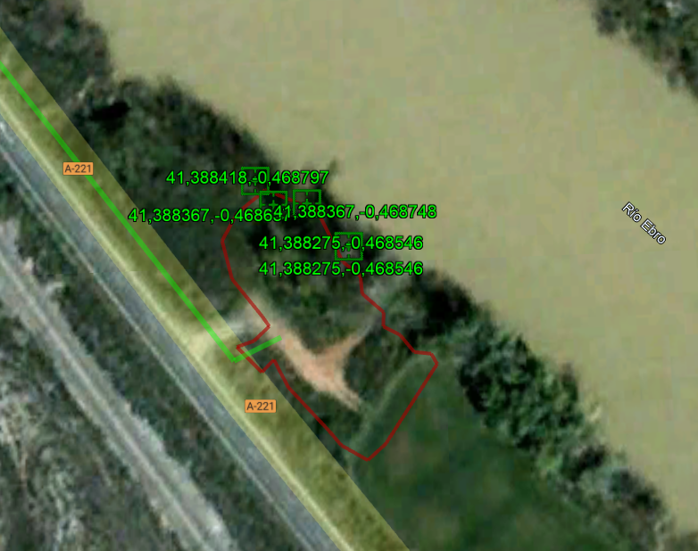
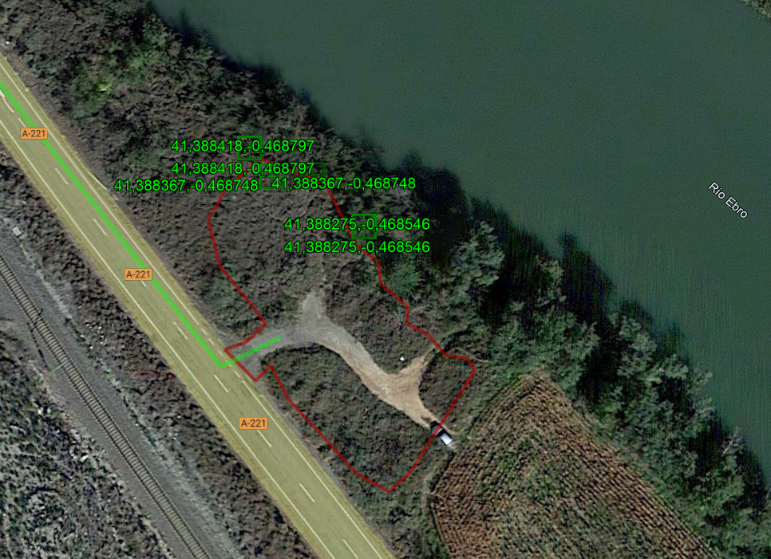
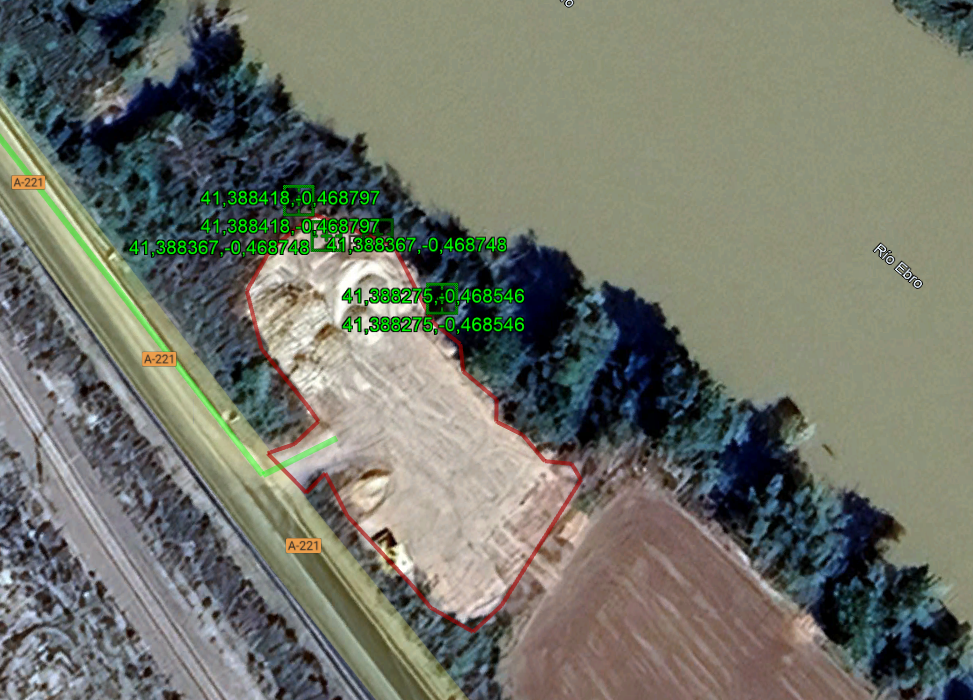

# Proyecto de construcción de observatorio de avifauna mediante apantallamiento en el paraje xx de Quinto (Zgz) v1

*X: 711.641 Y: 4.584.962, TM Quinto* 
<!-->Ribera Baja carreteras Recibidos RBB Pablo Vicente Adjuntos 10 ene 2025, 18:19 (hace 4 días) para mí, Luis</-->
# Introducción
La zona donde se ubicará el observatorio es una explanada de 1457 m2 con una cota máxima de 153.7 msnm  y una mínima de 152.9 msnm con pendientes decrecientes de casi un metro en dirección a la orilla y paralela a ésta. 

Tal y como se aprecia en las imágenes, la zona de intervención ha sufrido una degradación extrema. Desde 2004 hasta hace casi un año, se mantenía en niveles parecidos a los del resto de la ribera; pero desde 2024, se arrasó para acopio de material de obra y todavía no se ha restaurado.






La explanada misma es suelo vegetal agregado y apisonado de forma muy irregular, `sobreelevando` el talud existente, cuya pendiente -a pesar de su inclinación- está vegetada con olmos, zarzas y carrizo, y Onopordon y otras nitrófilas -además de plántulas de más zarzas- cubriendo el suelo (a falta de un estudio de vegetación pormenorizado en fechas idóneas). Lo que da idea de la `adsorción` presente, procedente del **freático cercano a superficie**. Hay que tener en cuenta que la lámina del Ebro en ese punto está a 147,1 msnm (IGN) -148 msnm GE-. 

A consecuencia del uso dado a la explanada y los elementos observados, se aprecian **fisuras en el borde del talud**, lo que hace desaconsejable colocar el observatorio muy cerca del borde y actuar sobre éstas.
[FOTO]

Finalmente, se ha convertido en un área degradada susceptible de depósito de más residuos, con la consiguiente perturbación, abandono de residuos, vertidos y molestias a la fauna allí existente y la cercana colonia de ardéidas.

Con todas estas premisas previas (material de obra abandonado, tipología de vegetación y geometría de talud, riesgo de molestias a la avifauna y de vertidos) se plantea una serie de actuaciones para su mejora:

- Aclareo y rebaje de pendiente
- Sobreelevado
- Revegetado
- Área de acceso
- Observatorio

## 1. Aclareo y rebaje de pendiente (Vertedero)
Aquí se plantea una reducción de la pendiente mediante el retranqueo de la mota hasta eliminar las grietas, que se ubican a medio metro del canto. Esta intervención nos permite un aclareo coincidente con la ventana de observación del apantallamiento de unos 4-5 metros y el resto, un cordón hasta los 13 metros, dependiendo de la longitud de la pantalla. Según cálculos preliminares (Ver Anexo 2) se obtendrían 7,8 toneladas de `tierra vegetal`.

## 2. Preparación de la zona de intervención (Vertedero)
La zona de intervención arriba descrita (ver introducción) se viene usando desde hace muy poco tiempo como punto de acopio de material de obra civil y carreteras (arena, zahorra, balasto y restos de bitumisos). Un cálculo grosero en base a trabajo de campo se obtiene las siguientes cantidades de residuos de obra:

- Balasto (Anexo 3): 42 m3 / 75,6 Ton
- Zahorra (Anexo 4): 18,16 m3 / 29,06 Ton
- Arena (Anexo 5):5 m3 / 8 Ton

En total, la cantidad a reutilizar asciende a unas 112,6 toneladas, a las que habría que sumar las 7,8 toneladas del epígrafe anterior (Aclareo y rebaje de pendiente). Entre 100 y 120 toneladas.

A esto hay que añadir la presencia de restos que podrían corresponder con de material asfáltico (LER 17 01 07) -pendiente de categorizar- y que podrían proceder de demoliciones de firme. Se estima un bidón con unos 50-70 kg de residuo a gestionar.

## 5. Revegetado de la zona (Préstamo)
En base a los cálculos de necesidades de materiales para la plataforma del apantallado, se propone el reparto de balasto para delimitar acceso y aparcamientos y sobreelevar el resto unos 15 cms. En una aproximación grosera a falta de un replanteo *in situ*, se estima la revegetación del 50% de la superficie mediante mezcla de sobrantes minerales y tierra vegetal. Esto supone que, para una superficie de 1457 m2 y mitad de espesor (7.5 cms) supone unas 110 toneladas y otras tantas de zahorra. Dado que, después de las necesidades de sobreelevado, quedan 50 toneladas de balasto y 21 toneladas de zahorra, por tanto, se propone un préstamo de 141 toneladas de tierra vegetal más una siembra directa de alfalfa, a razón de 16 kg/ha (FAO)


## 4. Observatorio (Préstamo)
 ![C:\Users\jesus\OneDrive\Escritorio\[BBR][Quinto]\BBR Quinto [Pantalla-A3_1_50.pdf](image-3.png) El observatorio es una pantalla corrida mediante tablones de 1,5 metros soportados por postes de 2 metros que se alojan en pozos de 30x30x40 cms a rellenar con hormigón. Se estima en unos 252 m3.
 

## 3. Sobreelevado (préstamo)
En base a las necesidades de sobreelevar para montar el apantallado ![C:\Users\jesus\OneDrive\Escritorio\[BBR][Quinto]\BBR Quinto [Pantalla-A3_1_50.pdf](image-3.png) se estima que el volumen necesario asciende a 45 toneladas (ver Anexo 1). Con lo cual, a priori, habría más que suficiente. Pero es imprescindible la tierra vegetal encima del balasto y la zahorra y su posterior compactación (mediante riego) para asegurar un suelo cohesionado que permita la apertura de zapatas para los postes. Por lo tanto, se aprecia la falta de suelo vegetal para los taludes generados, así como para el resto de la zona (ver Revegetado)

## 6. BALANCE
Teniendo en cuenta que los vertederos son materiales en existencias a comprometer y los préstamos son las necesidades calculadas, el balance queda *grosso modo* de la siguiente forma:

- Vertedero (apdo. 1 y 2) Tierra vegetal {7,8 Ton; Balasto 75 Ton; Zahorra 29 Ton}
- Préstamos (apdo. 3 Sobreelevado) -45 Ton {Tierra vegetal, -7 Ton; Balasto, -30 Ton; Zahorra, -8 Ton} 
- Préstamos (apdo. 5 Revegetado) {Balasto, -50 Ton; Zahorra, -21 Ton; Tierra vegetal -141 Ton} 
- BALANCE {Balasto 0 Ton; Zahorra, 0; Tierra vegetal -141 Ton}

| Ubicación | Material   | Cantidad (Toneladas) | Etapa (Observaciones) |
|--------------|------------|---------------------|-----------------------|
| Vertedero 1-2| Tierra vegetal | 7,8                | Construcción (Inicial) |
|             | Balasto     | 75                 | Construcción (Inicial) |
|             | Zahorra     | 29                 | Construcción (Inicial) |
| Préstamo 3   | Tierra vegetal | -7                 | Excavación (Sobrelevado) |
|             | Balasto     | -30                | Excavación (Sobrelevado) |
|             | Zahorra     | -8                 | Excavación (Sobrelevado) |
| Préstamo 5   | Balasto     | -50                | Restauración (Revegetado) |
|             | Zahorra     | -21                | Restauración (Revegetado) |
|             | Tierra vegetal | -141               | Restauración (Revegetado) |
| Balance     | Balasto     | 0                  | Final                   |
|             | Zahorra     | 0                  | Final                   |
|             | Tierra vegetal | -141               | Final                   |


# ANEXO 1. BORRADOR Cálculo de volumen y peso de prisma truncado con rampa

## Metodología y cálculos preliminares

### 1. Cálculo de áreas base
* **Base inferior**: 7.72m × 5.25m = 40.53 m²
* **Base superior**: 4.25m × 6.72m = 28.56 m²

### 2. Volumen del prisma truncado
```
Fórmula: V = h × (A₁ + A₂ + √(A₁ × A₂)) ÷ 3
Donde:
- h = 1 metro (altura)
- A₁ = 40.53 m² (área base inferior)
- A₂ = 28.56 m² (área base superior)

V = 1 × (40.53 + 28.56 + √(40.53 × 28.56)) ÷ 3
V = 1 × (40.53 + 28.56 + √1157.53) ÷ 3
V = 1 × (40.53 + 28.56 + 34.02) ÷ 3
V = 103.11 ÷ 3
V = 34.37 m³
```

### 3. Volumen de la rampa
```
V = base × altura × largo
V = 3.1 × (1 ÷ 2) × 4.07
V = 6.31 m³
```

### 4. Cálculo del volumen total
```
Vtotal = Vprisma - Vrampa
Vtotal = 34.37 - 6.31
Vtotal = 28.06 m³
```

### 5. Cálculo del peso
```
Peso = Volumen × densidad
Peso = 28.06 m³ × 1.6 toneladas/m³
Peso = 44.90 toneladas
```

## Resultados finales
* **Volumen total de tierra**: 28.06 metros cúbicos
* **Peso total**: 44.90 toneladas


# ANEXO 2. BORRADOR de Cálculo de volumen y peso de sección triangular 

## Datos iniciales
- Altura del triángulo: 1.5m
- Base del triángulo: 0.5m
- Longitud de extensión: 13m
- Densidad de tierra: 1.6 ton/m³

## Cálculos detallados

### 1. Cálculo del tercer lado (hipotenusa)
```
Usando teorema de Pitágoras:
a = 1.5m (altura)
b = 0.25m (mitad de base)
c = hipotenusa

c² = a² + b²
c² = 1.5² + 0.25²
c² = 2.25 + 0.0625
c² = 2.3125
c = √2.3125
c ≈ 1.52 metros
```

### 2. Cálculo de superficie triangular
```
Área = (base × altura) ÷ 2
Área = (0.5m × 1.5m) ÷ 2
Área = 0.375 m²
```

### 3. Cálculo del volumen prismático
```
Volumen = área de sección × longitud
Volumen = 0.375m² × 13m
Volumen = 4.875 m³
```

### 4. Cálculo del peso total
```
Peso = volumen × densidad
Peso = 4.875m³ × 1.6 ton/m³
Peso = 7.8 toneladas
```

## Resultados finales
* **Longitud del tercer lado**: 1.52 metros
* **Área de la sección**: 0.375 metros cuadrados
* **Volumen total**: 4.875 metros cúbicos
* **Peso total**: 7.8 toneladas


# ANEXO 3. BORRADOR de Cálculo de volumen de cordón de balasto

## Datos iniciales
- Ancho: 3 metros
- Largo: 8 metros
- Altura promedio: 1.75 metros
- Densidad típica del balasto: 1.8 ton/m³

## Cálculos detallados

### 1. Cálculo del volumen
```
Volumen = ancho × largo × altura
V = 3m × 8m × 1.75m
V = 42 metros cúbicos
```

### 2. Cálculo del peso (referencial)
```
Peso = volumen × densidad
Peso = 42m³ × 1.8 ton/m³
Peso = 75.6 toneladas
```

## Resultados finales
* **Volumen total**: 42 metros cúbicos
* **Peso aproximado**: 75.6 toneladas

# ANEXO 4. BORRADOR de Cálculo de volumen y peso de pirámides de zahorra

## Datos iniciales
### Pirámides 1 y 2
- Área de base: 16 m²
- Altura: 1 metro
- Cantidad: 2 pirámides

### Pirámide 3
- Base rectangular: 5 × 3 metros = 15 m²
- Altura: 1.5 metros
- Cantidad: 1 pirámide

### Densidad
- 1 m³ = 1.6 toneladas

## Cálculos detallados

### 1. Volumen y peso de pirámides 1 y 2
```
Fórmula volumen: V = (1/3) × área_base × altura
V = (1/3) × 16m² × 1m
V = 5.33 m³ por pirámide

Volumen total (2 pirámides) = 5.33m³ × 2
Volumen total = 10.66 m³

Peso = 10.66m³ × 1.6 ton/m³
Peso = 17.06 toneladas
```

### 2. Volumen y peso de pirámide 3
```
Fórmula volumen: V = (1/3) × área_base × altura
V = (1/3) × (5m × 3m) × 1.5m
V = (1/3) × 15m² × 1.5m
V = 7.5 m³

Peso = 7.5m³ × 1.6 ton/m³
Peso = 12 toneladas
```

### 3. Totales del conjunto
```
Volumen total = 10.66m³ + 7.5m³ = 18.16 m³
Peso total = 17.06 ton + 12 ton = 29.06 toneladas
```

## Resultados finales
### Volúmenes
* **Pirámides 1 y 2**: 10.66 metros cúbicos
* **Pirámide 3**: 7.5 metros cúbicos
* **Total**: 18.16 metros cúbicos

### Pesos
* **Pirámides 1 y 2**: 17.06 toneladas
* **Pirámide 3**: 12 toneladas
* **Total**: 29.06 toneladas

# ANEXO 5. BORRADOR de Cálculo de volumen y peso de pirámide de arena

## Datos iniciales
- Base rectangular: 5 × 3 metros = 15 m²
- Altura: 1 metro
- Densidad de arena: 1.6 toneladas/m³

## Cálculos detallados

### 1. Cálculo del volumen
```
Fórmula: V = (1/3) × área_base × altura
V = (1/3) × (5m × 3m) × 1m
V = (1/3) × 15m² × 1m
V = 5 metros cúbicos
```

### 2. Cálculo del peso
```
Peso = volumen × densidad
Peso = 5m³ × 1.6 ton/m³
Peso = 8 toneladas
```

## Resultados finales
* **Volumen total**: 5 metros cúbicos
* **Peso total**: 8 toneladas

---
*Nota: Los cálculos asumen que la pirámide es regular y que la densidad de la arena es uniforme.*