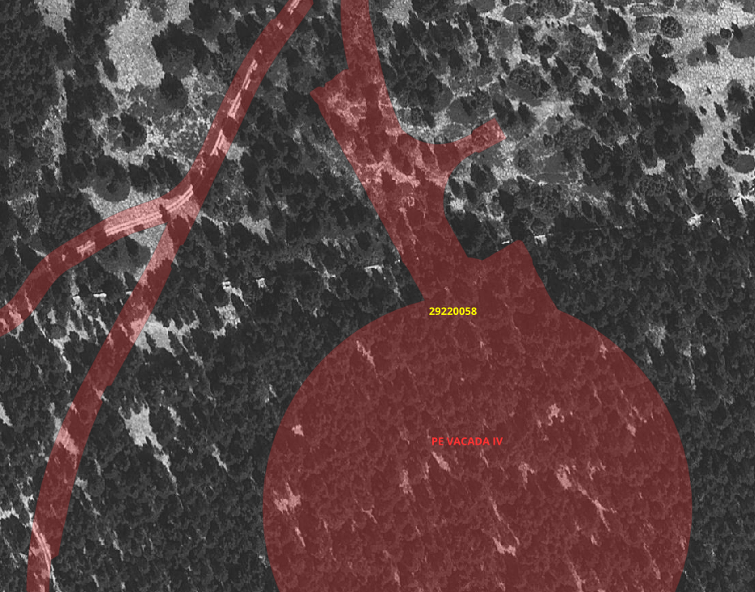
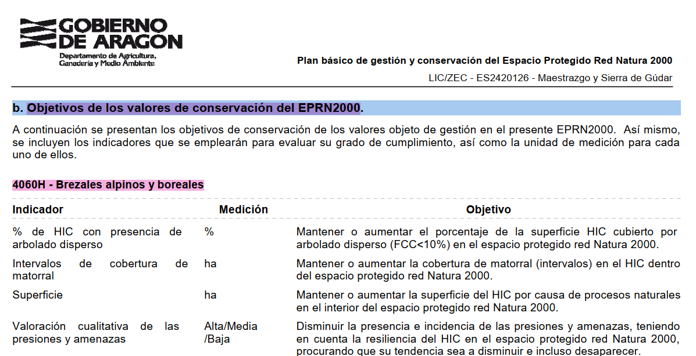

    revisión peritaje Maestrazgo
    Recibidos
    Luis Tirado Blázquez
    jue, 19 dic, 16:52 (hace 16 horas)

    En rojo están algunas frases que no se pueden decir, ten mucho cuidado con el lenguaje somos SEO/BirdLife, ya nos echaron en cara cuestiones así en el juzgado de Logroño. En general hay cosas en rojo y ya tiene que estar el peritaje limpio, si tienes dudas me dices.

    Revisa el índice que está fa
    tal, pasamos del 5 al 7,... vigila por favor este tipo de detalles que están nada más abrir el texto,....

    Y muy importante de los siguientes parques; necesito dos o tres párrafos de cada uno, resumiendo lo importante del impacto de los mismos en las aves. En un word aparte normal y corriente:

# Impacto de los Parques Eólicos [PEs] Vacada IV, El Cid I, La Estrella II y Cabecero II sobre la avifauna

## Vacada IV
### Situación
Este PE se encuentra a tres kilómetros al Oeste de Mosqueruela (Teruel) e integramente dentro del Lugar de Importancia Comunitaria [LIC] ES2420126 Maestrazgo y Sierra de Gúdar <ref>NATURA 2000 - STANDARD DATA FORM [SDF]

For Special Protection Areas (SPA),
Proposed Sites for Community Importance (pSCI),
Sites of Community Importance (SCI) and
for Special Areas of Conservation (SAC)
SITE	ES2420126
SITENAME	MAESTRAZGO Y SIERRA DE GÚDAR https://natura2000.eea.europa.eu/Natura2000/SDF.aspx?site=ES2420126</ref> , así como parte de sus instalaciones de evacuación. 

Así mismo, este LIC tiene su correspondiente **Plan básico de gestión y conservación **<ref>RESOLUCIÓN de 4 de marzo de 2021, del Director General de Medio Natural y Gestión Forestal, por la que se dispone la publicación de determinados Planes del anexo II del Decreto 13/2021, de 25 de enero, del Gobierno de Aragón, por el que se declaran las Zonas de Especial Conservación en Aragón, y se aprueban los Planes Básicos de Gestión y Conservación de las Zonas de Especial Conservación y de las Zonas de Especial Protección para las Aves de la Red Natura 2000 en Aragón. Publicado el 13/03/2021 (Nº 55) que remite a  "Boletín Oficial de Aragón", número 24, de 5 de febrero de 2021, se ha publicado el Decreto 13/2021, de 25 de enero, del Gobierno de Aragón, por el que se declaran las Zonas de Especial Conservación en Aragón, y se aprueban los planes básicos de gestión y conservación de las Zonas de Especial Conservación y de las Zonas de Especial Protección para las Aves de la Red Natura 2000 en Aragón.</ref> En donde se listan las especies de fauna, flora y hábitats -estos últimos como soporte vital del resto- y los objetivos de conservación establecidos específicamente para cada uno de los elementos contemplados.

Este LIC delimita una serie de hábitats, cartografiados por MITECO [Hábitats de Interés Comunitario del Anexo I de la Directiva 92/43/CEE](https://www.miteco.gob.es/es/biodiversidad/servicios/banco-datos-naturaleza/informacion-disponible/index_habitat_descargas.html) -que aquí queremos resaltar que es un documento de fuerza legal suficiente y documento de prueba de lo que aquí se expone- que en el caso que nos ocupa, el PE Vacada IV, se encuentra integramente sobre los habitats de referencia [29220058] que se corresponden en su mayor parte con el Hábitat 4060 [Brezales alpinos y boreales](https://www.jolube.net/Habitat_Espana/documentos/4060.pdf)[4060] y se identifica con el subtipo de *Comunidades de sabina rastrera y pino albar pertenecientes a la alianza Pino-Juniperion sabinae (306040)* [4060:19] que se define como *formaciones mixtas abiertas desarrolladas sobre sustratos ricos en bases. Constituyen la etapa madura del piso oromediterráneo en enclaves muy continentalizados, con amplio contraste térmico y fuerte xerofilia del suelo que impide el establecimiento de pinares densos de Pinus sylvestris. Es un tipo de vegetación relíctico de épocas glaciares y periglaciares de la Península Ibérica, **de enorme valor biogeográfico**. Son formaciones de P. sylvestris, que en general no presenta mucha cobertura y un estrato arbustivo dominado por Juniperus sabina que actúa como etapa pionera para el establecimiento de la comunidad Se sitúan sobre sustrato calizo, **bajando en situaciones favorecidas hasta los 1.500 m*** [vidsupra]

Sin embargo, aquí habría que hacer una apreciación importante al hilo de lo resaltado en la reseña arriba adjunta. el PE objeto de este análisis se ubica por encima de los 1700 msnm, lo que; a la vista de las imágenes de satélite usadas y la densa cobertura arbórea presente, permite especular con que estamos ante masas de [Pinus x rhaetica](https://es.wikipedia.org/wiki/Pinus_x_rhaetica) tal y como se demuestra en el correspondiente artículo citado, y con coordenadas publicadas en la misma ubicación que el PE Vacada IV, lo que conllevaría la catalogación de esta zona como característica del hábitat [9430 Bosques montanos y subalpinos de Pinus uncinata (en sustratos yesosos o calcáreos) (*)](https://www.miteco.gob.es/content/dam/miteco/es/biodiversidad/temas/espacios-protegidos/9430_tcm30-196906.pdf), es decir, un Hábitat de Interés Comunitario **Prioritario** [HICP] Todo ello, en clara discrepancia con el Estudio de Impacto Ambiental [EsIA] que emplea otros criterios de clasificación de la vegetación en base a CORINE, que es transversal a varios HIC y aumenta la confusión del análisis, en clara alineación con el objetivo de favorecer la construcción del PE objeto de la cuestión. 

*Detalle de la superficie afectada por uno de los aerogeneradores del PE Vacada IV*

### Afecciones
De la lectura de la [SDF] se concluye que el PE objeto de este análisis afecta al hábitat 4060, que es el soporte vital de varias especies de avifauna:

| Group | Code | Species | Value1 | Value2 | Status | Col1 | Col2 | Col3 | Col4 |
|-------|------|---------|---------|---------|---------|------|------|------|------|
| B | A085 | **Accipiter gentilis** | 0 | 0 | P | | | X | X |
| B | A086 | **Accipiter nisus** | 0 | 0 | P | | | X | X |
| B | A087 | Buteo buteo | 0 | 0 | P | | | X | X |
| B | A366 | Carduelis cannabina | 0 | 0 | P | | | X | X |
| B | A364 | Carduelis carduelis | 0 | 0 | P | | | X | X |
| B | A335 | Certhia brachydactyla | 0 | 0 | P | | | X | X |
| B | A363 | Chloris chloris | 0 | 0 | P | | | X | X |
| B | A264 | Cinclus cinclus | 0 | 0 | P | | | X | X |
| B | A350 | Corvus corax | 0 | 0 | P | | | X | X |
| B | A237 | Dendrocopos major | 0 | 0 | P | | | X | X |
| B | A383 | Emberiza calandra | 0 | 0 | P | | | X | X |
| B | A378 | Emberiza cia | 0 | 0 | P | | | X | X |
| B | A377 | Emberiza cirlus | 0 | 0 | P | | | X | X |
| B | A096 | **Falco tinnunculus** | 0 | 0 | P | | | X | X |
| B | A244 | Galerida cristata | 0 | 0 | P | | | X | X |
| B | A655 | Lanius excubitor meridionalis | 0 | 0 | P | X | | X | X |
| B | A369 | Loxia curvirostra | 0 | 0 | P | | | X | X |
| B | A261 | Motacilla cinerea | 0 | 0 | P | | | X | X |
| B | A328 | Parus ater | 0 | 0 | P | | | X | X |
| B | A329 | Parus caeruleus | 0 | 0 | P | | | X | X |
| B | A327 | Parus cristatus | 0 | 0 | P | | | X | X |
| B | A330 | Parus major | 0 | 0 | P | | | X | X |
| B | A357 | Petronia petronia | 0 | 0 | P | | | X | X |
| B | A235 | Picus viridis | 0 | 0 | P | | | X | X |
| B | A250 | Ptyonoprogne rupestris | 0 | 0 | P | | | X | X |
| B | A276 | Saxicola torquatus | 0 | 0 | P | | | X | X |
| B | A362 | Serinus citrinella | 0 | 0 | P | | | X | X |
| B | A362 | Serinus citrinella | 0 | 0 | P | | | X | X |
| B | A361 | Serinus serinus | 0 | 0 | P | | | X | X |
| B | A332 | Sitta europaea | 0 | 0 | P | | | X | X |
| B | A219 | Strix aluco | 0 | 0 | P | | | X | X |
| B | A213 | Tyto alba | 0 | 0 | P | | | X | X |

Fuente: [SDF:5](https://natura2000.eea.europa.eu/Natura2000/SDF.aspx?site=ES2420126)

Así mismo, en base a la tabla arriba adjunta, se observa que gran parte de la fauna contemplada como valores a preservar del citado LIC son, en un 43%, especies ligadas, en mayor o menor medida, a hábitats forestales y el resto, a espacios abiertos, lo que refuerza lo antedicho sobre los hábitats descritos, estableciendo una clara relación entre hábitats y avifauna amenazada, en clara contraposición con lo afirmado en el EsIA, que generaliza -y vanaliza- al afirmar que el impacto de este PE se produce sobre bosques de Pinus sylvestris [cita], cuando esa afirmación es falsa.

Este PE es, por tanto, una clara amenaza y su ejecución supondrá daños de dificil o imposible reparación sobre los hábitats arriba mencionados, hábitats por otra parte cuyos objetivos de conservación establecidos se incumplirían:

 que, en síntesis todos ellos consisten en ***mantener o aumentar*** dicho HIC

### 29220058 
    ODHABITAT,C,15	CODIGO_UE,C,4	CONCEPTO,C,254	PRIORITARI,C,1	INDNATURAL,C,1	COBERTURA,N,19,11	TIPO_COBER,C,1	CODIGO,C,8

    4060	+Junipero sabinae-Pinetum sylvestris+ Rivas Goday & Borja 1961		2	0	3	29220058
    6175	+Festucetum hystricis+ Font Quer 1954		1	0	2	29220058

    Fuente: MITECO

| CODIGO_UE | CONCEPTO | INDNATURAL | COBERTURA | TIPO_COBER | CODIGO |
|-----------|----------|------------|-----------|------------|---------|
| 4060 | +Junipero sabinae-Pinetum sylvestris+ Rivas Goday & Borja 1961 | 2 | 0 | 3 | 29220058 |
| 6175 | +Festucetum hystricis+ Font Quer 1954 | 1 | 0 | 2 | 29220058 |

Fuente:[Hábitat (Directiva 92/43/CEE) (de 26 La Rioja a 50 Zaragoza)](https://www.miteco.gob.es/es/biodiversidad/servicios/banco-datos-naturaleza/informacion-disponible/habitat_descargas_2.html)

## El Cid I
Este PE se ubicará a 4,8 kilómetros al este de Cantavieja y a tan solo 1428 metros al oeste de la [IBA nº 149 Puertos de Morella](https://datazone.birdlife.org/site/factsheet/morella-pass-iba-spain/details), que también es LIC [ES5223002, L'alt Maestrat](https://natura2000.eea.europa.eu/Natura2000/SDF.aspx?site=ES5223002) Además, 5 de los 8 aerogeneradores y su evacuación ocupan casi todo el HIC 29210060 [MITECO]

| CODIGO_UE | CONCEPTO | INDNATURAL | COBERTURA | TIPO_COBER | CODIGO |
|-----------|----------|------------|-----------|------------|---------|
| 4090 | +Saturejo gracilis-Erinaceetum anthyllidis+ Rivas Goday & Borja 1961 corr. Izco & Molina | 1 |	0 | 2 | 29210060 |
Fuente:[Hábitat (Directiva 92/43/CEE) (de 26 La Rioja a 50 Zaragoza)](https://www.miteco.gob.es/es/biodiversidad/servicios/banco-datos-naturaleza/informacion-disponible/habitat_descargas_2.html)

[4090 BREZALES OROMEDITERRÁNEOS ENDÉMICOS CON ALIAGA, MANUAL DE GESTIÓN DEL HABITAT: FICHA DE MANEJO Y CONSERVACION DICIEMBRE, 2011 Gobierno de Aragón ](https://www.aragon.es/documents/20127/674325/4090_HIC_MED.pdf/047a02f8-dd76-6a24-9d7a-4010fd69595d)

[BONET, F. J., ZAMORA, R., GASTÓN, A., MOLINA, C. & BARIEGO, P., 2009. 4090 Matorrales pulvinulares orófilos europeos meridionales. En: VV.AA., Bases ecológicas preliminares para la conservación de los tipos de hábitat de interés comunitario en España. Madrid: Ministerio de Medio Ambiente, y Medio Rural y Marino. 122 p.](https://www.jolube.net/Habitat_Espana/documentos/4090.pdf)

<!-->[Endangered species and bird populations in IBA](https://claude.ai/chat/d379dc63-f5f2-4a99-874d-dc795229adc2) Hacer una tabla en markdown con este encabezado: Species Red List    Season (year/s of estimate) Size IBA criteria y los siguientes datos, englobando en el apartado de "IBA criteria" los valores que se encuentran entre el apartado "Size" y el primer valor de la columna siguiente, el "Species Red List":
Egyptian Vulture Neophron percnopterus  EN  breeding (2008) 3 pairs A1, C1, C6
Griffon Vulture Gyps fulvus LC  resident (2008) 26 pairs    C6
Bonelli's Eagle Aquila fasciata LC  resident (2005) present B2
Red-billed Chough Pyrrhocorax pyrrhocorax   LC  resident (2009) 77–106 pairs    B2, C2
Black Wheatear Oenanthe leucura LC  resident (1997) 40 pairs    B2</-->

| Species Red List | Season (year/s of estimate) | Size | IBA criteria |
|------------------|------------------------|------|--------------|
| Egyptian Vulture Neophron percnopterus (EN) | breeding (2008) | 3 pairs | A1, C1, C6 |
| Griffon Vulture Gyps fulvus (LC) | resident (2008) | 26 pairs | C6 |
| Bonelli's Eagle Aquila fasciata (LC) | resident (2005) | present | B2 |
| Red-billed Chough Pyrrhocorax pyrrhocorax (LC) | resident (2009) | 77–106 pairs | B2, C2 |
| Black Wheatear Oenanthe leucura (LC) | resident (1997) | 40 pairs | B2 |
Fuente: [BirdLife International (2024) Important Bird Area factsheet: Morella pass (Spain). Downloaded from https://datazone.birdlife.org/site/factsheet/morella-pass-iba-spain on 24/12/2024](https://datazone.birdlife.org/site/factsheet/morella-pass-iba-spain/details)

<!-->Genera una tabla en markdown, pero hay que tener cuenta que la cabecera consta de 1 nivel y 2 subniveles. El nivel 1:  las columnas Species, Population in the site y  Site assessment. La columna Species se divide en 5 columnas (subnivel 1) con las siguientes subcolumnas: G,   Code,    Scientific Name, S y NP   ;Population..  consta de otras 5 subcolumnas (subnivel 1):  T, Size,   Unit,    Cat. t    D.qual. . Site.. que consta de 2 subcolumnas (subnivel 1): "A|B|C|D" y "A|B|C". Subnivel 2 debajo de "Size" se divide a su vez en 2 subcolumnas:  Min y  Max. Finalmente,  debajo de " A|B|C|D"     sólo  la columna Pop. (subnivel 2) y debajo de  "A|B|C"  3 subcolumnas (subnivel 2):Con. ,  Iso.  y   Glo. con los siguientes datos : B   A255    Anthus campestris           p   0   0       P       D            
B   A091    Aquila chrysaetos           p   1   5   p       G   C            
B   A215    Bubo bubo           p   6   10  p       G   C   B   C   B
B   A243    Calandrella brachydactyla           p   0   0       P       D            
B   A224    Caprimulgus europaeus           r   0   0       P       D            
B   A080    Circaetus gallicus          r   1   5   p       G   C   B   C   B
B   A379    Emberiza hortulana          p   0   0       P       D            
B   A103    Falco peregrinus            p   1   5   p       G   C   B   C   B
B   A245    Galerida theklae            p   0   0       P       D            
B   A078    Gyps fulvus         p   11  50  p       G   C   B   C   B
B   A092    Hieraaetus pennatus         r   1   5   p       G   C   B   C   B
B   A246    Lullula arborea         p   0   0       P       D            
B   A279    Oenanthe leucura            p   0   0       P       D            
B   A346    Pyrrhocorax pyrrhocorax         p   0   0       P       D            
B   A302    Sylvia undata           p   0   0       P       D</-->

| Species |||||Population in the site||||| Site assessment |||
|---|---|---|---|---|---|---|---|---|---|---|---|---|
| G | Code | Scientific Name | S | NP | T | Size ||| Cat. | D.qual. | A\|B\|C\|D | A\|B\|C ||
|||||| | Min | Max |||| Pop. | Con. | Iso. | Glo. |
| B | A255 | Anthus campestris | | | p | 0 | 0 | | P | | D | | | |
| B | A091 | Aquila chrysaetos | | | p | 1 | 5 | p | G | C | | | | |
| B | A215 | Bubo bubo | | | p | 6 | 10 | p | G | C | B | C | B | |
| B | A243 | Calandrella brachydactyla | | | p | 0 | 0 | | P | | D | | | |
| B | A224 | Caprimulgus europaeus | | | r | 0 | 0 | | P | | D | | | |
| B | A080 | Circaetus gallicus | | | r | 1 | 5 | p | G | C | B | C | B | |
| B | A379 | Emberiza hortulana | | | p | 0 | 0 | | P | | D | | | |
| B | A103 | Falco peregrinus | | | p | 1 | 5 | p | G | C | B | C | B | |
| B | A245 | Galerida theklae | | | p | 0 | 0 | | P | | D | | | |
| B | A078 | Gyps fulvus | | | p | 11 | 50 | p | G | C | B | C | B | |
| B | A092 | Hieraaetus pennatus | | | r | 1 | 5 | p | G | C | B | C | B | |
| B | A246 | Lullula arborea | | | p | 0 | 0 | | P | | D | | | |
| B | A279 | Oenanthe leucura | | | p | 0 | 0 | | P | | D | | | |
| B | A346 | Pyrrhocorax pyrrhocorax | | | p | 0 | 0 | | P | | D | | | |
| B | A302 | Sylvia undata | | | p | 0 | 0 | | P | | D | | | |

Fuente:  [NATURA 2000 - STANDARD DATA FORM For Special Protection Areas (SPA), Proposed Sites for Community Importance (pSCI), Sites of Community Importance (SCI) and for Special Areas of Conservation (SAC) End2022-12/03/24](https://natura2000.eea.europa.eu/natura2000/SDF.aspx?site=ES5223002&release=33&form=Clean)

A la vista de la tabla arriba adjunta se puede concluir que estamos ante espacios abiertos como así se demuestra en las capas que MITECO proporciona y, por consiguiente, muchas de las especies, susceptibles de colisión con los aeros a construir, `tal y como se describe en el pericial`.

## La Estrella II

## Cabecero II
