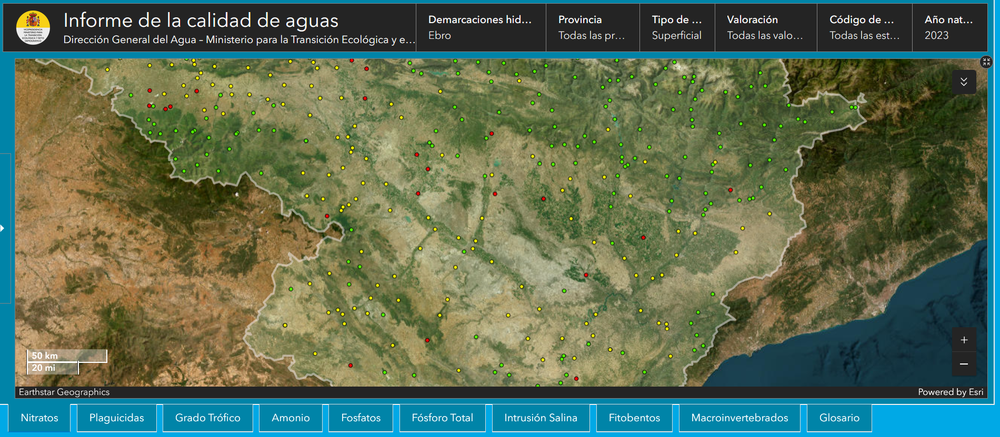
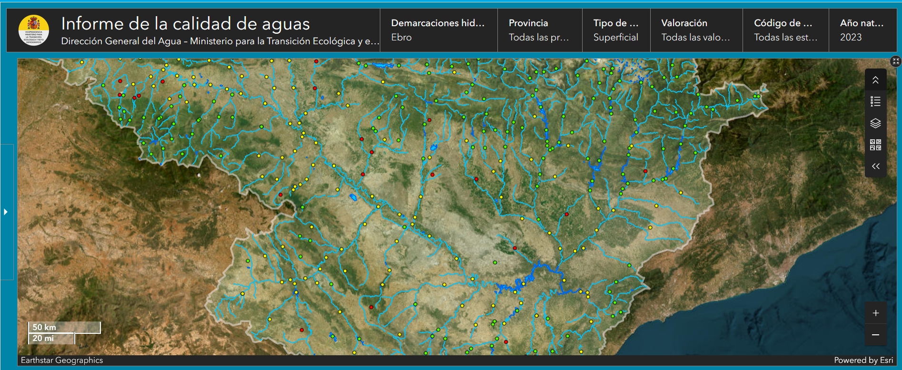

[INFORME SOBRE CALIDAD DE LAS AGUAS 2010-2022](https://www.miteco.gob.es/content/dam/miteco/es/agua/temas/estado-y-calidad-de-las-aguas/informes-calidad-de-las-aguas/Informe-Calidad-Aguas-2010-2022.pdf) [ICA22]

*artículo 92.ter del Real Decreto Legislativo 1/2001, de 20 de julio, por el que se aprueba el texto refundido de la Ley de Aguas* [Comprobar si se hizo transposición completa]

[NABIA](https://www.arcgis.com/apps/dashboards/469c05fa7fc848088d57cf0ed43fe9f8)
[Patrón de número de estaciones inversamente proporcional a los usos de agua y al caudal de los cursos o cuerpos de agua] 

## Río Gállego [EBR0453]
Demarcación	Ebro
Código DDHH	DHE
Provincia	
Municipio	
Concentración	13,866667
Unidades	mg NO3/l
Valoración	> 5 - 25 mg/L NO3
Número analíticas	6
Número puntos de muestreo	1
Año natural	2023
Categoría	RW
UTMX	678505,000000
UTMY	4613295,000000
HUSO	30

## Barranco de la Violada desde su nacimiento hasta su desembocadura en el río Gállego [EBR0120]

### Nitratos
Demarcación	Ebro
Código DDHH	DHE
Provincia	
Municipio	
Concentración	39,700000
Unidades	mg NO3/l
Valoración	> 25 mg/L NO3
Número analíticas	9
Número puntos de muestreo	1
Año natural	2023
Categoría	RW
UTMX	691113,000000
UTMY	4646885,000000
HUSO	30

### Plaguicidas
Código DDHH	DHE
Provincia	
Municipio	
Valoración	> `Valor frontera`
Número analíticas	578
Número puntos de muestreo	1
Año natural	2023
Categoría	RW
UTMX	691113
UTMY	4646885
HUSO	30

## Río Gállego desde el barranco de la Violada hasta el azud de Urdán [EBR0817]
### Nitratos
Demarcación	Ebro
Código DDHH	DHE
Provincia	
Municipio	
Concentración	5,667059
Unidades	mg NO3/l
Valoración	> 5 - 25 mg/L NO3
Número analíticas	17
Número puntos de muestreo	2
Año natural	2023
Categoría	RW
UTMX	683605,000000
UTMY	4631950,000000
HUSO	30

### Plaguicidas
Demarcación	Ebro
Código DDHH	DHE
Provincia	
Municipio	
Valoración	> LQ y < Valor frontera
Número analíticas	505
Número puntos de muestreo	1
Año natural	2023
Categoría	RW
UTMX	683605
UTMY	4631950
HUSO	30

## Barranco de la Valcuerna desde su nacimiento hasta su entrada en el Embalse de Mequinenza [EBR0146]

### Nitratos
Concentración	97,770000
Unidades	mg NO3/l
Valoración	> 25 mg/L NO3
Número analíticas	10
Número puntos de muestreo	1
Año natural	2023
Categoría	RW
UTMX	747950,000000
UTMY	4599325,000000
HUSO	30

### Plaguicidas
Valoración	> `Valor frontera`
Número analíticas	576
Número puntos de muestreo	1
Año natural	2023
Categoría	RW
UTMX	747950
UTMY	4599325
HUSO	30

## Clamor Amarga desde su nacimiento hasta su desembocadura en el río Cinca [EBR0166]
### Nitratos
Concentración	34,818182
Unidades	mg NO3/l
Valoración	> 25 mg/L NO3
Número analíticas	11
Número puntos de muestreo	1
Año natural	2023
Categoría	RW
UTMX	782015,000000
UTMY	4623382,000000
HUSO	30

### Plaguicidas
Valoración	> `Valor frontera`
Número analíticas	578
Número puntos de muestreo	1
Año natural	2023
Categoría	RW
UTMX	782015
UTMY	4623382
HUSO	30

## Laguna de la Playa [EBL0989] 
### Nitratos
Concentración	0,296000
Unidades	mg NO3/l
Valoración	≤ 5 mg NO3/L
Número analíticas	4
Número puntos de muestreo	1
Año natural	2023
Categoría	LW
UTMX	734944,000000
UTMY	4589205,000000
HUSO	30

### Plaguicidas
Valoración	> `LQ` y < `Valor frontera`
Número analíticas	204
Número puntos de muestreo	1
Año natural	2023
Categoría	LW
UTMX	734944
UTMY	4589205
HUSO	30

## Huerva [EBR0113]
### Nitratos 
Concentración	11,925000
Unidades	mg NO3/l
Valoración	> 5 - 25 mg/L NO3
Número analíticas	2
Número puntos de muestreo	1
Año natural	2023
Categoría	RW
UTMX	633806,000000
UTMY	4580876,000000
HUSO	30

### Plaguicidas
Valoración	> `Valor frontera`
Número analíticas	501
Número puntos de muestreo	1
Año natural	2023
Categoría	RW
UTMX	652006
UTMY	4556734
HUSO	30