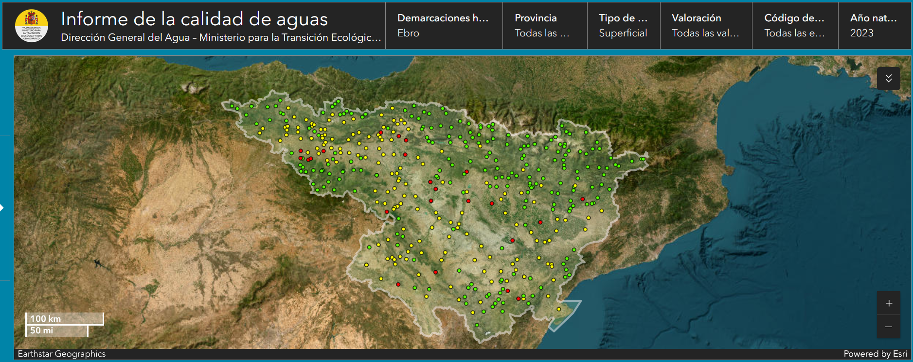
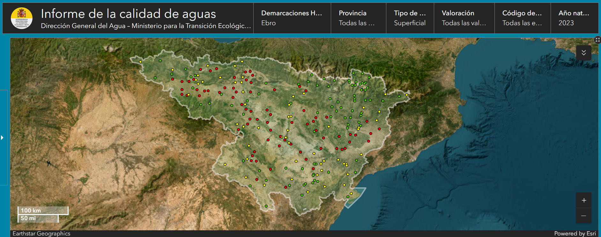

A la vista de los puntos de muestreos de la Demarcación Hidrográfia del Ebro (DHE) se puede sacar la conclusión rápida y fácil de que la mayoría de las concentraciones de NOx encontradas están en valores por debajo del límite marcado por la legislación vigente. Si se entra en el detalle, esa conclusión se respalda con las cifras:  un *94,4% de las estaciones por debajo de 25 mg/l*. Prácticamente todas. Congrats!

En el caso de los plaguicidas en agua, la situación es un poco más regulinchi
 pero más de la mitad por debajo de los `límites legales`:  *65,8% de las estaciones por debajo del límite de la NCA*