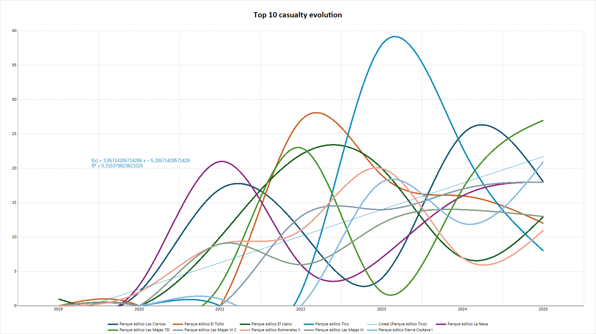

A la vista de la respuesta a una solicitud de información de SEO /BirdLife sobre mortandad de aves por colisión contra aerogeneradores [AEs] y apoyos de líneas aéreas de media y alta  tensión [LATs], desde 2019 a 2025, se han entregado al Centro  9385 aves muertas. Este matiz es importante, porque la procedencia es variada: APNs, GC o subcontratas de los parques eólicos que a su vez pueden haber hecho entrega de los cadáveres. Es decir, no hay una metodología de recogida pautada en periodos de tiempo. Por tanto, una primera conclusión es que, esa cantidad puede ser una fracción de la mortandad real causada por AEs.

En síntesis, 

Además, 

1. A lo largo de los años se han **endurecido los controles y exigencias** por parte del Gobierno de Aragón. 
2. En paralelo, otros parques eólicos [PEs] han **rebasado el plazo de emisión de los informes** de seguimiento ambiental. Por tanto, ya no reportan colisiones y sólo proceden de APNs/GC de forma esporádica, en función de la disponibilidad en el servicio.
3. Ha habido un **aumento exponencial de PEs** 
4. Derivada de la 2, al ser en ocasiones retiradas esporádicas, el factor de error en el seguimiento y el factor de desaparación de la carroña en campo contribuyen aún más a 

Con todas estas variables, es muy dificil establecer un marco que establezca en detalle pautas y evolución de la mortalaidad de aves en el periodo analizado.

A los solos hechos reflejados en la tabla objeto de análisis, hay un claro aumento exponencial de la mortandad, *que no lo sería tanto por el incremento también exponencial de las instalaciones de PEs*. Sin embargo, se pueden establecer varias hipótesis previas y, si son válidas, llegar a establecer conclusiones. 

1. A la vista de la gráfica  no hay correlación alguna entre mortalidades.
2. La tendencia de **todos** los Top 10 es ascendente (R[^2]=0,3-0,4) a pesar de que en algún momento presentan tendencia descendente que pudiera obedecer a múltiples causas:
   
    - Menor tráfico de aves por perturbaciones (construcción de otros PEs)
    - Cambio metodológico
    - Cambio en la frecuencia de recogida de cadáveres y entrega de los mismos
    - Errores de muestreo

3. 

<!--Es el caso de determinados PEs concentren año tras año.  -->