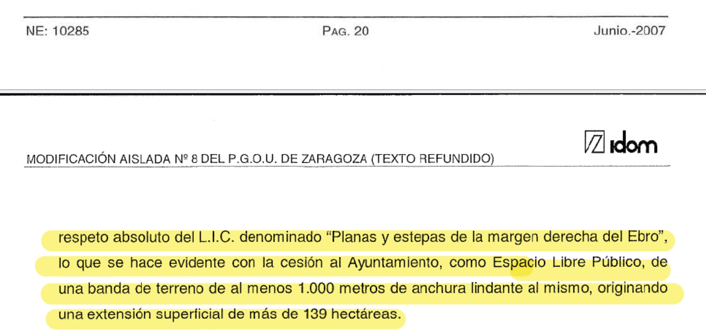
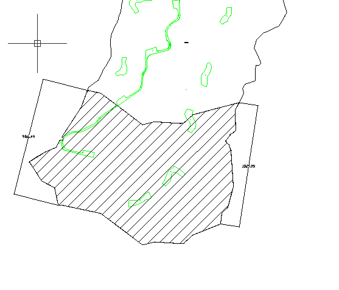

`Ref: 1465528/2004`
Texto Refundido de la Modificación Aislada Nº8 del Plan General de ordenación Urbana [MA8] Aprobado con caracter definitivo el 30 de mayo de 2008 

`Servicio Jurídico de ordenación y Gestión Urbanística. Gerencia Municipal de Urbanismo. Ayuntamiento de Zaragoza` Avda. Hispanidad nº20, Edificio Seminario 50071 Zaragoza

# Solicitud de Información en materia de medio ambiente sobre el estado de ejecución de la MA8

## COMPARECE Y EXPONE

### PRIMERO  Texto Refundido de la Modificación Aislada Nº8 del PGOU
El 30 de mayo de 2008 se aprobó con caracter definitivo Texto Refundido de la Modificación Aislada Nº8 del Plan General de ordenación Urbana [MA8] que incluía varias determinaciones, entre ellas:

>*protección del L.I.C. “Planas y estepas de la margen derecha del Ebro” mediante una banda exterior de anchura no menor de 1.000 metros con calificación de espacio Libre público* [MA8:13]

Determinación que se repite a lo largo del texto refundido

### SEGUNDO Información ambiental
Que esta información tiene carácter ambiental, según el artículo 2.3 de la Ley 27/2006, de 18 de julio, por la que se regulan los derechos de acceso a la información, de participación pública y de acceso a la justicia en materia de medio ambiente[^1] (incorpora las Directivas 2003/4/CE y 2003/35/CE) y más en concreto y en relación con este proyecto concurren las definiciones dadas en los párrafos del citado artículo:
>3. Información ambiental: toda información en forma escrita, visual, sonora, electrónica o en cualquier otra forma que verse sobre las siguientes cuestiones:    
    >>a) El estado de los elementos del medio ambiente, como el aire y la atmósfera, el agua, el suelo, la tierra, los paisajes y espacios naturales, incluidos los humedales y las zonas marinas y costeras, la diversidad biológica y sus componentes, incluidos los organismos modificados genéticamente; y la interacción entre estos elementos

Por todo lo anterior,

## EJERCITA
### El DERECHO DE ACCESO A LA INFORMACIÓN en materia de Medio Ambiente, en los términos establecidos en la citada Ley,

SOLICITANDO que en el plazo máximo que dicta la Ley[^2], de **un mes** desde la recepción de la solicitud, se nos dé traslado:
>- Copia del expediente o expedientes generados durante el procedimiento administrativo inciado y finalizado, con su autorización administrativa motivada, origen de las obras observadas.

>- Cuanta información complementaria o asociada a expediente nos pueda ser de utilidad en el marco del artículo 5 de la citada ley, la Ley 27/2006, de 18 de julio.

OTROSÍ DIGO Que en el caso de que en la documentación solicitada existiese información que fuese motivo de excepción por verse afectado negativamente cualquier extremo, en aplicación del Artículo 13.2 de la Ley 27/2006, de 18 de julio[^3], se justifiquen y motiven las razones concretas de dicha afección, proporcionando acceso al resto de la información, eliminando la información objeto de excepción dado que la información solicitada nos es imprescindible.

----
[^1]: Ley 27/2006, de 18 de julio, por la que se regulan los derechos de acceso a la información, de participación pública y de acceso a la justicia en materia de medio ambiente (incorpora las Directivas 2003/4/CE y 2003/35/CE). BOE núm. 171, de 19/07/2006

[^2]: La Ley 27/2006, de 18 de julio, en su artículo 10 establece el plazo máximo de un mes desde la recepción de la solicitud en el registro de la autoridad pública competente para resolver [N de A]

[^3]:  *b) Facilitar información para su correcto ejercicio, así como consejo y asesoramiento en la medida en que resulte posible. ... d) Garantizar que su personal asista al público cuando trate de acceder a la información ambiental. e) Fomentar el uso de tecnologías de la información y de las telecomunicaciones para facilitar el acceso a la información. f) Garantizar el principio de agilidad en la tramitación y resolución de las solicitudes de información ambiental*