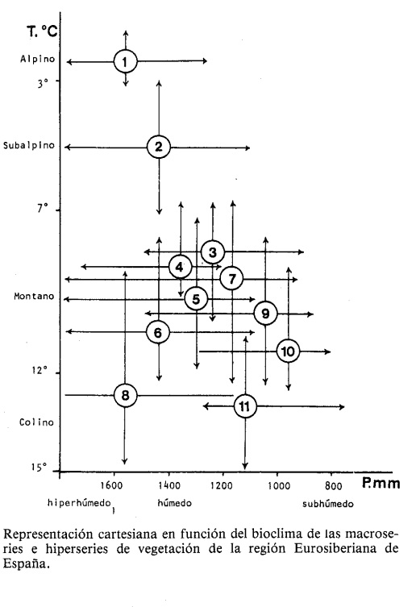

# CLIMA Y FITOCLIMATOLOGÍA DE BENASQUE

La caracterización de la climatología hecha en el ESTUDIO IMPACTO AMBIENTAL
TELECABINA MONOCABLE ENTRE BENASQUE Y CERLER
EIAB-2020-2021
BENASQUE
(HUESCA)
INGENIERÍA Y CONTROL DE OBRAS E INSTALACIONES SL.
FEBRERO 2021 [EsIA]

carece de utilidad a efectos de identificar los hábitats existentes<ref>*La temperatura media anual en el entorno de la telecabina se ha obtenido calculando el valor medio de las temperaturas mensuales de la estación meteorológica 9838B de Benasque y de la estación meteorológica de Eriste en el refugio Ángel Orús desde los años 2014 a 2019* [EsIA:30]</ref>, reducida a la media de temperaturas de los 6 últimos años, que no son representativos de nada, dado que se requieren al menos 20 años de observaciones[cita].

En cuanto a las precipitaciones, las conclusiones del EsIA no pueden ser más desafortunadas [EsIA:31], por recoger sólo las de Eriste y Benasque, cuando debieran haber recogido una malla de estaciones y calcular medias más robustas y extrapolar, a razón de 100 litros/m2 por cada 100 metros, en una aproximación grosera el final del TC en Cerler. No, el EsIA sólo hace una media de ambas estaciones y todo ello sin citar las fuentes, origen de estos datos.

La razón de contar con datos de climatología de fuentes solventes no es otra que establecer con éstos la vegetación potencial de la zona afectada por el TC Benasque-Cerler.

En base a Martinez<ref>MEMORIA DEL MAPA
DE SERIES DE VEGETACION DE ESPANA [RIVAS87] SALVADOR RIVAS-MARTINEZ ICONA
NIPa: 254-87-0n-4
r.S.B.N.: 84-85496-25-6
Estación Alt. años T M m **It** P Piso bioclimático
----
Benasque 1.138 31 9,9 8,2 -3,3 **138** 1152 Mesomontano [RIVAS87:35] Definido el piso bioclimático y considerando *grosso modo* un aumento de precipitaciones de 100 mm anuales y -0.5ºC por cada 100 metros de elevación, a Cerler (1540 msnm) le correspondería una precipitación entorno a 1400 mm y un descenso de 1,5ºC sobre Benasque. Sobre estos valores, resulta un** Índice de Termicidad de 103**. Ambas localidades -principio y fin del TC- estarían dentro del piso bioclimático Montano -y particularmente Cerler, dentro del Montano Superior- caracterizados por una temperatura media T de 6º a 10°, una media de las mínimas m de -4 a 0ºC , y de las Máximas (M) de 3º a 8ºC. A esos valores le correspondería un valor de It 50 a 180. Además, tal y como se concluye, la zona afectada tiene un ombroclima hiperhúmedo.

En base a estas características climáticas y el sustrato ácido se estaría ante 5 tipos de vegetación potencial:

3a) Serie altimontana pirenaica silicícola del
pino albar (Pinus sylvestris). Veronico
oficinalis-Pineto sylvestris sigmetum

4b) Serie altimontana pirenaica acidófila del
abeto (Abies alba). Goodyero-Abieteto
albae sigmetum.

5c) Serie montana pirenaica acidófila del haya (Fagus sylvatica). Luzulo niveae-Fageto sigmetum

6c) Serie montana pirenaica mesofítica del
fresno (Fraxinus excelsior). Brachypodio
sylvatici-Fraxineto excelsioris sigmetum

 y en base a los trabajos de campo:

10) Serie montana pirenaica del roble peloso
(Quercus pubescens). Buxo-Querceto pubescentis sigmetum

 [RIVAS:57]

En relación con esta vegetación potencial -o teórica- el EsIA sólo acierta a identificar las fresnedas y confunde vegetación potencial con observaciones muy vagas e imprecisas, cometiendo errores de bulto importantes (como afirmar que hay Quercus robur<ref></ref>):
[Mapa de distribución de Quercus robur robur L., IPE CESIC](http://floragon.ipe.csic.es/mapa_distribuccion.php?cod_taxon=1299a&genero=Quercus&especie=robur&subespecie=robur&variedad=)

    La vegetación potencial en el subsector es la correspondiente a la serie montana pirenaica mesofítica del fresno (Fraxinus excelsior): Brachypodio sylvatici-Fraxineto excelsioris sigmetum. La serie montana pirenaica mesofítica del fresno corresponde en su etapa madura a un bosque mixto que se desarrolla generalmente en el fondo de valles y coluviones de pie de montes, en el que son preponderantes árboles como Fraxinus excelsior y Corylus avellana y en los que aparecen también otros árboles caducifolios como Populus tremula, Betula pendula, Quercus robur [sic], Acer campestre, Quercus petraea, etc.
     
     En el sotobosque, cuando es alterado, y en el lindero forestal arbustivo existen numerosos elementos del propio bosque como el Corylus avellana, conviviendo con otros más heliófilos, como el Rubus Caesius..

[EsIA:49-50]

Puesta en relación la vegetación potencial con la encontrada en base a los trabajos de campo, la primera conclusión es que, sin perjuicio de encontrar rodales en futuras prospecciones, no hay rastro de abetales y los hayedos están reducidos a pequeñas arboledas fragmentarias, sin embargo, una política conservacionista se traduciría en una evolución de los hábitats actuales hacia los potenciales relatados, y con ellos, la avifauna ligada a éstos últimos.