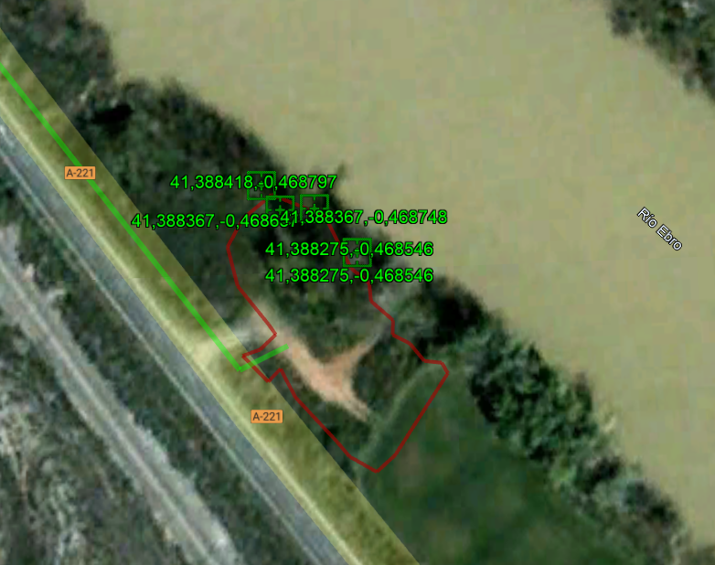
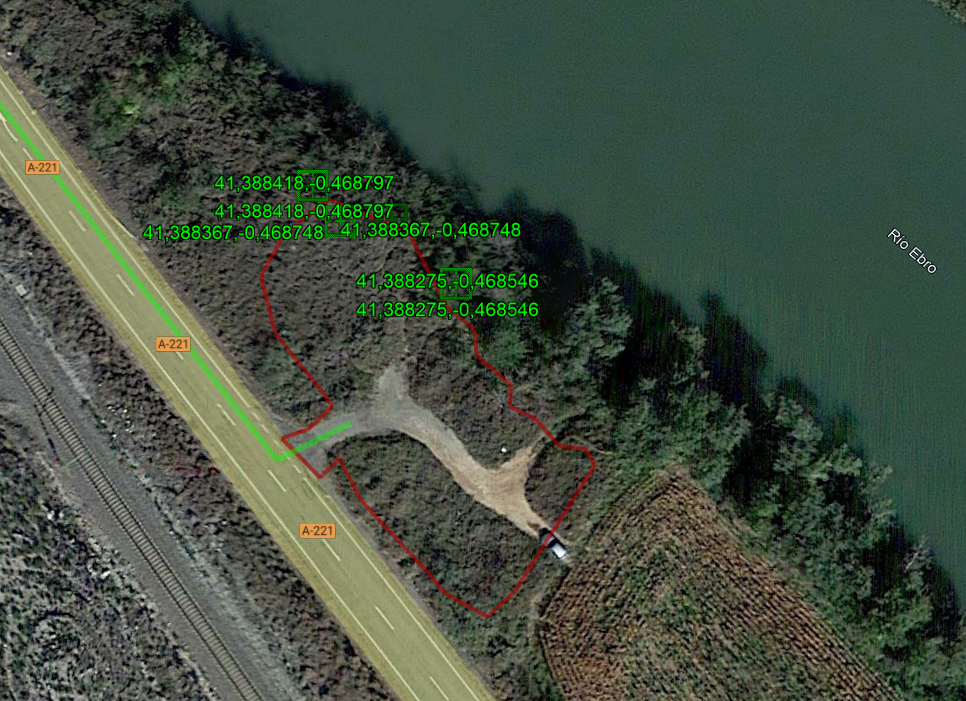
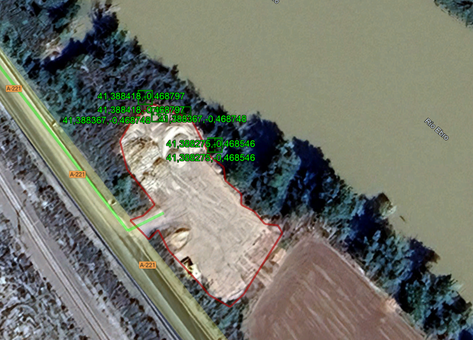

# Proyecto de construcción de observatorio de avifauna mediante apantallamiento en el paraje xx de Quinto (Zgz) v1

*X: 711.641 Y: 4.584.962, TM Quinto* 
<!-->Ribera Baja carreteras Recibidos RBB Pablo Vicente Adjuntos 10 ene 2025, 18:19 (hace 4 días) para mí, Luis</-->

La zona donde se ubicará el observatorio es una explanada de 1457 m2 con una cota máxima de 153.7 msnm  y una mínima de 152.9 msnm con pendientes decrecientes de casi un metro en dirección a la orilla y paralela a ésta. 

Tal y como se aprecia en las imágenes, la zona de intervención ha sufrido una degradación extrema. Desde 2004 hasta hace casi un año, se mantenía en niveles parecidos a los del resto de la rivera; pero desde entonces, se arrasó para acopio de material de obra y no se ha restaurado.

Así, la zona se viene usando como punto de acopio de material de obra y carretera (arena, zahorra, balasto y restos de bitumisos). Un cálculo grosero en base a trabajo de campo se obtiene las siguientes cantidades de residuos de obra:

La explanada misma es suelo vegetal agregado y apisonado de forma muy irregular, `sobreelevando` el talud existente, cuya pendiente -a pesar de su inclinación- está vegetada con olmos, zarzas y carrizo, y Onopordon y otras nitrófilas -además de plántulas de más zarzas- cubriendo el suelo (a falta de un estudio de vegetación pormenorizado en fechas idóneas). Lo que da idea de la `adsorción` presente, procedente del **freático cercano a superficie**. 

Finalmente, consecuencia del uso dado a la explanada y los elementos observados, se aprecian **fisuras en el borde del talud**, lo que hace desaconsejable colocar el observatorio muy cerca del borde.

Con todas estas premisas (material de obra abandonado, tipología de vegetación y geometría de talud) se debe plantear una serie de actuaciones para su mejora:

- Aclareo y rebaje de pendiente
- Sobreelevado
- Revegetado
- Área de acceso

## Aclareo y rebaje de pendiente
Aquí se plantea una reducción de la pendiente mediante el retranqueo de la mota hasta eliminar las grietas, que se ubican a medio metro del canto. Esta intervención nos permite un aclareo coincidente con la ventana de observación del apantallamiento de unos 4-5 metros y el resto, un cordón hasta los x metros, dependiendo de la longitud de la pantalla. 

## Zona de intervención

## Sobreelevado

