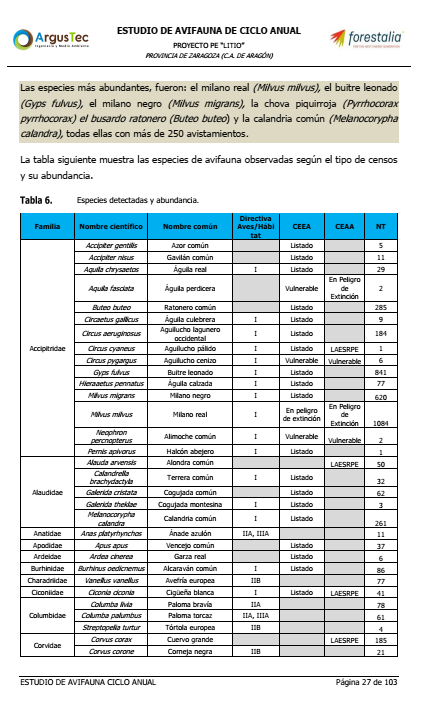
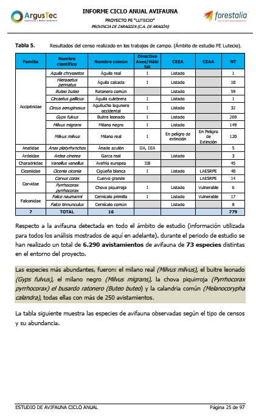
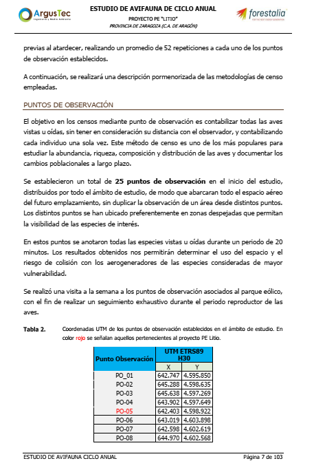
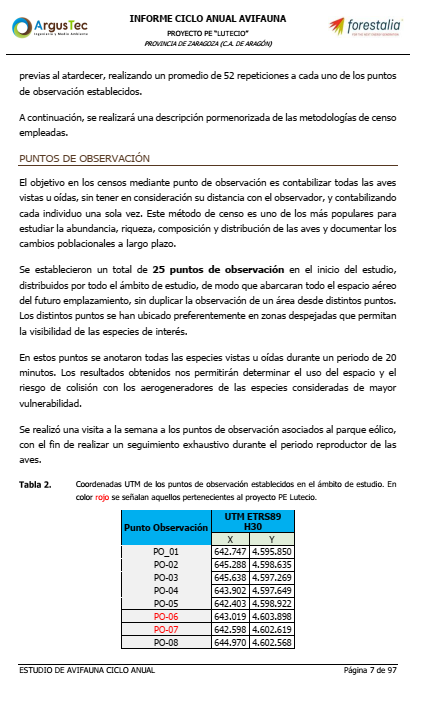

## EXPONE:

PRIMERO.– Que en el Boletín Oficial Aragón[^1] [BOA] nº101 29/5/25 se publica Anuncio del Servicio Provincial de Zaragoza, por el que se somete a información pública, la solicitud de autorización administrativa previa y de construcción, del proyecto parque eólico “PE [Lutecio]” de 30,5 MW de la empresa Next Generation Energy Lutecio, SLU, así como su estudio de impacto ambiental. (Expediente G-Z-2024/097)

SEGUNDO.- Que en virtud de su condición de interesada en el procedimiento de autorización del mencionado proyecto y conforme a lo establecido en el artículo 83.2 de la Ley 39/2015[^1] de 2 de octubre, del Procedimiento Administrativo Común de las Administraciones Públicas, solicita formular las siguientes alegaciones, que las mismas sean incorporadas al procedimiento y tenidas en cuenta:

## ALEGACIONES

### CONSIDERACIONES PREVIAS 
Este PE -representada por [NEXT GENERATION ENERGY IRIDIO SL](https://www.datoscif.es/empresa/next-generation-energy-iridio-sl)- y su EsIA es un calco de otros dos PEs, presentados todos ellos de forma fraccionada, cuya empresa matriz es la misma: Fernando Sol SL como administrador, que lo es además de Forestalia y cuyo socio único es Nearco renovables SL 

PRIMERA.- Este PE afecta a numerosas especies de aves, tal y como se reconoce en el EsIA objeto de estas alegaciones:

#### Resultados del censo realizado en los trabajos de campo. (Ámbito de estudio PE Lutecio) Fuente: INFORME CICLO ANUAL AVIFAUNA PROYECTO PE “LUTECIO” PROVINCIA DE ZARAGOZA (C.A. DE ARAGÓN) Argustec, página 25 de 97

| Familia | Nombre científico | Nombre común | Directiva Aves/Hábitat | CEEA | CEAA | NT |
|---------|-------------------|--------------|------------------------|------|------|-----|
| Accipitridae | *Aquila chrysaetos* | Águila real | I | Listado | | 1 |
| Accipitridae | *Hieraaetus pennatus* | Águila calzada | I | Listado | | 10 |
| Accipitridae | *Buteo buteo* | Ratonero común | | Listado | | 59 |
| Accipitridae | *Circaetus gallicus* | Águila culebrera | I | Listado | | 1 |
| Accipitridae | *Circus aeruginosus* | Aguilucho lagunero occidental | I | Listado | | 32 |
| Accipitridae | *Gyps fulvus* | Buitre leonado | I | Listado | | 269 |
| Accipitridae | *Milvus migrans* | Milano negro | I | Listado | | 149 |
| Accipitridae | *Milvus milvus* | Milano real | I | En peligro de extinción | En Peligro de Extinción | 120 |
| Anatidae | *Anas platyrhynchos* | Ánade azulón | IIA, IIIA | | | 5 |
| Ardeidae | *Ardea cinerea* | Garza real | | Listado | | 3 |
| Charadriidae | *Vanellus vanellus* | Avefría europea | IIB | | | 45 |
| Ciconiidae | *Ciconia ciconia* | Cigüeña blanca | I | Listado | LAESRPE | 40 |
| Corvidae | *Corvus corax* | Cuervo grande | | | LAESRPE | 14 |
| Corvidae | *Pyrrhocorax pyrrhocorax* | Chova piquirroja | I | Listado | Vulnerable | 6 |
| Falconidae | *Falco naumanni* | Cernícalo primilla | I | Listado | Vulnerable | 17 |
| Falconidae | *Falco tinnunculus* | Cernícalo común | | Listado | | 87 |

**TOTAL: 16 especies, 859 individuos**

En la tabla arriba reproducida del literal se observa que se presenta el total acumulado de observaciones a lo largo del periodo de estudio de la avifauna. Muestra de lo deficiente que es este documento. Además, en el resto de los PEs adjuntan una tabla parecida pero conservan en todos ellos el mismo recuadro debajo reproducido:

EsIA con párrafos repetidos en los otros 3 PEs en periodo de alegaciones en mismas fechas.

Además, los cálculos sobre riqueza (Índice de Margalef [^x]) están realizados sobre premisas falsas: usan el acumulado de ejemplares observados a lo largo de todo el estudio de avifauna como valor de base, que difiere de la realidad. Es lo mismo que contar tráfico de vehículos de una calle y calcular en base a todos los que han pasado a todas horas durante todos los días; cuando los estudios de tráfico se basan en medias, y además, por franjas horarias. En conclusión, los estudios de avifauna presentandos en este EsIA no pueden servir para dictaminar impactos de un proyecto sobre la avifauna. 

PRIMERA.- Según el  Anexo VI.1.e de la Ley 21/13[^1] se requiere *un examen multicriterio de las distintas alternativas que resulten ambientalmente más adecuadas, **incluida la alternativa cero**, o de no actuación, y que sean técnicamente viables*
[EsIA:19-21]  Sin embargo, no consta tal Alternativa 0.

SEGUNDA.- En el Apartado **4. Id, cuantificación..** del citado Anexo de la misma Ley no consta tal cuantificación, por cuanto sólo se aplica una metodología de análisis de tipo cualitativo, como es el Vicente Conesa tal y como se constata en el apartado del  EsIA sobre Análisis de Impactos [EsIA:185]

**5. Cuantificación repercusiones RN2000** `Reconoce afecciones por proximidad a Dehesa de Rueda ES2430090` Sin embargo minimiza esas afecciones sin aportar pruebas de ningún tipo, ni referencias de fuentes solventes o acreditadas:

*Dada la distancia a los espacios protegidos Red Natura 2000, se desestiman afecciones directas a los valores objeto de conservación y gestión así como a sus objetivos de conservación, **sin que se vea comprometida su conectividad ni los valores por los que estos espacios fueron declarados integrantes de la RN2000*** [EsIA:241]

El EsIA basa su estudio de afecciones sobre la Red Natura 2000 en la aplicación de una guía sobre el **impacto sobre los hábitats**, no sobre las aves, sin embargo, aplica un esquema sacado de una comunicación de la Unión Europea. Sin aportar más detalles metodológicos.[EsIA:254][^1]

    Cuando el proyecto pueda afectar directa o indirectamente a los espacios Red Natura 2000 se incluirá un apartado específico para la evaluación de sus repercusiones en el lugar, teniendo en cuenta los objetivos de conservación del espacio. Art. 35.c

[Guía metodológica de evaluación de impacto ambiental en Red Natura 2000 Criterios utilizados por la Subdirección General de Biodiversidad y Medio Natural para la determinación del perjuicio a la integridad de Espacios de la Red Natura 2000 por afección a Hábitats de interés comunitario. Versión enero 2019](https://www.miteco.gob.es/content/dam/miteco/es/biodiversidad/temas/espacios-protegidos/criteriossgbymnperjuiciohabitats_tcm30-481533.pdf)

En este sentido, y abundando en este aspecto hay que citar la modificación de la Ley 21/13 mediente la Ley 9/18[^Y] artículo9 Cuarenta y uno, en el cual se establece que:

 El anexo VI se sustituye por el siguiente:

 ...

 
a) Un examen multicriterio, estudiado por el promotor, de las distintas
alternativas que resulten ambientalmente más adecuadas, y sean relevantes para el
proyecto, incluida la alternativa cero, o de no actuación, y que sean técnicamente
viables para el proyecto propuesto y sus características específicas; y una
justificación de la solución propuesta, incluida una comparación de los efectos
medioambientales, que tendrá en cuenta diversos criterios, como el económico y el
funcional, y entre los que se incluirá una comparación de los efectos
medioambientales. La selección de la mejor alternativa deberá estar soportada por
un análisis global multicriterio, donde se tenga en cuenta, no sólo aspectos
económicos, sino también los de carácter social y ambiental.
b) Una descripción de las exigencias previsibles en el tiempo, en orden a la
utilización del suelo y otros recursos naturales, para cada alternativa examinada.
c) Respecto a la alternativa 0, o de no actuación, se realizará una descripción
de los aspectos pertinentes de la situación actual del medio ambiente (hipótesis de
referencia), y una presentación de su evolución probable en caso de no realización
del proyecto, en la medida en que los cambios naturales con respecto a la hipótesis
de referencia puedan evaluarse mediante un esfuerzo razonable, de acuerdo a la
disponibilidad de información medioambiental y los conocimientos científicos.

----
[1]: Ley 39/2015, de 1 de octubre, del Procedimiento Administrativo Común de las Administraciones Públicas. BOE núm. 236, de 2 de octubre de 2015
[1]: [COMUNICACIÓN DE LA COMISIÓN Evaluación de planes y proyectos en relación con espacios Natura 2000: orientación metodológica sobre el artículo 6, apartados 3 y 4, de la Directiva 92/43/CEE, sobre los hábitats (2021/C 437/01)](https://eur-lex.europa.eu/legal-content/ES/TXT/HTML/?uri=OJ:C:2021:437:FULL&from=SV)

En cuanto al estudio de avifauna, se encuentran numerosas irregularidades como por ejemplo; los mismos 20 puntos de muestreo en los 3 estudios:
; 

 Con lo cual, no son 20 los puntos de observación. Son bastantes menos.

[X]: ESTUDIO DE AVIFAUNA DE CICLO ANUAL PROYECTO PE “IRIDIO” 3.3.1. ANÁLISIS DE AVIFAUNA p.13
[Y]: Ley 9/2018, de 5 de diciembre, por la que se modifica la Ley 21/2013, de 9 de diciembre, de evaluación ambiental, la Ley 21/2015, de 20 de julio, por la que
se modifica la Ley 43/2003, de 21 de noviembre, de Montes y la Ley 1/2005,
de 9 de marzo, por la que se regula el régimen del comercio de derechos de
emisión de gases de efecto invernadero. BOE nº294, 6/12/18

