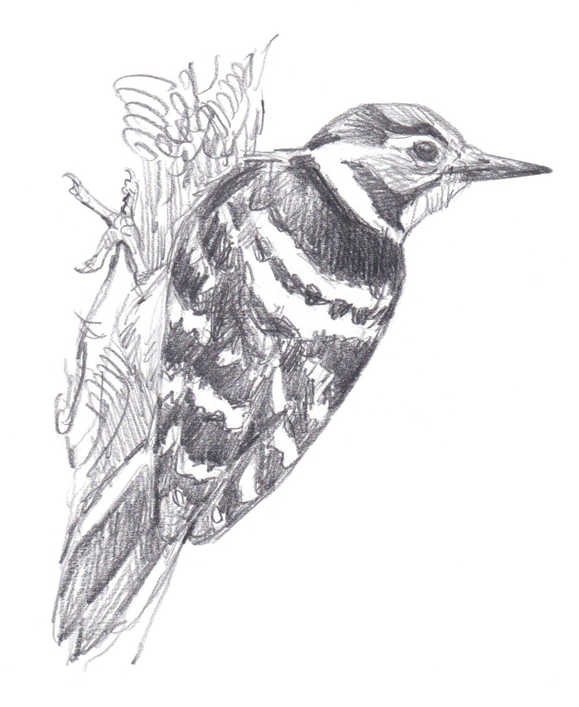
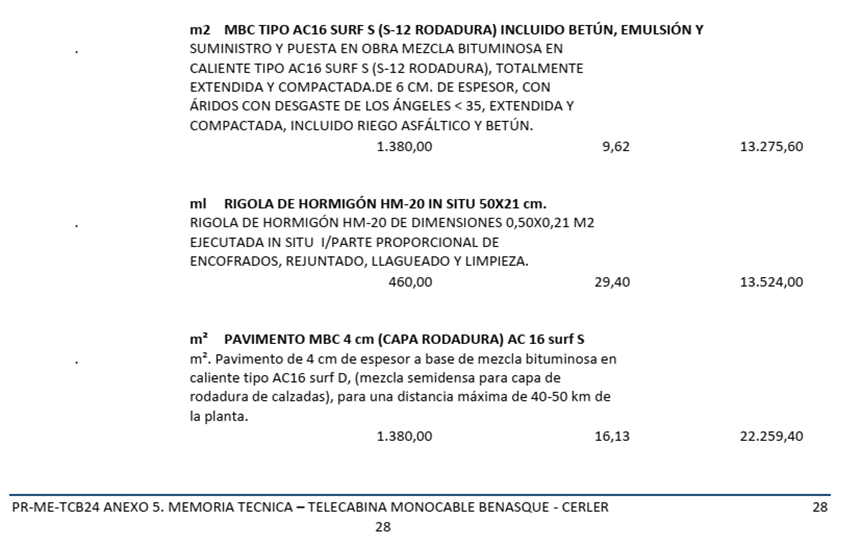

# INFORME SOBRE LOS HÁBITATS POTENCIALES PARA LA AVIFAUNA AFECTADOS POR EL TC CERLER BENASQUE 

`Benasque, diciembre de 2024`

## ESQUEMA 20/3 (HT 20/12)

1. Inventario hábitats (HICs)

2. HICPs 
    2.1. Mapas HICPs

3. Análisis afecciones espacios (Mapas a afecciones)
3.1. IBA
3.2. PNs
3.3. ZEPAs 

4. Aves (Distancias a afecciones)
4.1. Urogallo
4.2. Perdiz nival
4.3. Quebrantahuesos

Fuente: https://atlasaves.seo.org/ave/pico-menor/

## ÍNDICE

1	INTRODUCCIÓN	5
2	ÁREA DE ESTUDIO	7
3	CLIMATOLOGÍA Y HÁBITATS POTENCIALES	8
4	METODOLOGÍA	11
4.1. Análisis preliminar	11
4.2. Operativa de toma y procesado de datos	12
5	HÁBITATS PRESENTES Y ESTADO DE CONSERVACIÓN	14
5.1 Avellanedas riparias subcantábricas y pirenaicas	14
5.1.1. DISTRIBUCIÓN DE LAS AVELLANEDAS RIPARIAS SUBCANTÁBRICAS Y PIRENAICAS	15
5.1.2. Punto de Observación [PO] 42,599999,0,525094	15
	16
5.1.3. PO 42,597190,0,527537	16
	17
5.1.4. PO 42,595647,0,528702, 12:46	18
5.2. Fresnedas [MHNa:374] [HICP 91E0*] [13:10]	19
5.2.1. DISTRIBUCIÓN DE LAS FRESNEDAS [HICP 91E0*]	20
5.2.2. 42,593364,0,526784, 13:10	21
5.3. Tremoleras [MHNa:436] 818020c	21
5.3.1. DISTRIBUCIÓN DE TREMOLERAS	22
5.4. Tiledas [HICP 9180*]  [MHNa:444]	22
5.4.1. DISTRIBUCIÓN DE LAS TILEDAS [HICP 9180*]	23
5.5. Abedulares de Betula pendula [MHNa:438] [..20d] [14:05]	23
5.5.1. DISTRIBUCIÓN DE LOS ABEDULARES	24
5.6. Robledales de Quercus gr. pubescens 41.7132+ Boscos de roures (Quercus pubescens o híbrids), silicícoles, de la muntanya mitjana [MHCat:62]	24
5.6.1. DISTRIBUCIÓN DE LOS ROBLEDALES	24
5.6.2. 42,593520,0,526763	25
5.7. Pinares de pino royo (Pinus sylvestris) secundarios [MHNa:456]	25
5.8. Bojerales submediterráneos y pirenaicos [MHNa:204] [411015b]	26
6	HABITAT POTENCIAL DE ESPECIES AMENAZADAS	28
6.1. La Important Bird Area (IBA) nº128 Posets-Maladeta	28
6.2. ZEPA Posets y LIC ÉSERA	29
7 RESULTADOS Y DISCUSIÓN	31
  
## 1	INTRODUCCIÓN

El 24 de enero de 2024 se aprobó en pleno del Ayuntamiento de Benasque  el proyecto de Telecabina [TC] que uniría Benasque con Cerler una vez publicada la correspondiente Declaración de Impacto Ambiental [DIA] por parte de INAGA  en base a un Estudio de Impacto Ambiental [EsIA] que, en síntesis habla de un desarrollo de TC de 2084 metros y un ancho deforestado de 15 metros , además de las superficies en origen y destino que suman 1713 m2, sin embargo, el desglose es confuso y no contempla la superficie deforestada  entrando en contradicciones. Así, el cálculo de la deforestación a practicar asciende a 31,2 hectáreas. 
Posteriormente, en abril de 2024 se presentó una memoria técnica  para la licitación de la obra del TC, en la que se contempla la urbanización de 47 hectáreas  y la apertura de varios accesos (VER ANEXO I):

 Así mismo, el acceso para la construcción y el posterior mantenimiento del resto de pilonas de la línea se realizará principalmente a partir de la traza desbrozada y aprovechando los senderos cercanos ya trazados (sendero La Saleta  y camino Benasque-Cerler por Es Felegás ), minimizando así la superficie abarcada por estos accesos [MTP:23].
Esto supondrá la deforestación de sendas pistas donde antes sólo eran senderos que ahora forman parte de la infraestructura turística. En el caso de la Saleta, de al menos 2 kilómetros y un mínimo de 5 metros de ancho;  un mínimo de 10 hectáreas, En el caso de Es Felagás serían otros 5 kilómetros: 25 hectáreas. Así, el TC supondrá, en realidad, la deforestación y destrucción de 82 hectáreas, en su gran mayoría de bosque, cifra muy alejada de la reflejada por la DIA.
Muestra de que el proyecto ha entrado en manifiesta contradicción es que los parquines no se han contemplado en el EsIA ni en la DIA pero sí en el presupuesto:

 
Sólo en estas partidas ya hay 2700 m2 de pavimento, todo ello sin contar con los desbroces del TC y la conversión en pistas de acceso rodado para tráfico pesado de los caminos de La Saleta  y Es Felegás.

2	ÁREA DE ESTUDIO 

La zona afectada por el futuro telecabina entre Benasque y Cerler es una ladera de orientación noroeste y su piedemonte, comprendida entre la carretera de Cerler al este, la margen derecha del Barranco de Remascaró al sur, la carretera entre Anciles y el casco urbano de Benasque al oeste y Las Comas, el cementerio de Benasque y el PR HU-026 al norte. 
El paraje se reparte entre tres zonas; los márgenes del Barranco Fondo, el Tusal Redono y Remascaró. 
La margen derecha del Barranco Fondo se denomina Es Matoses -de fácil interpretación- y la margen izquierda, El Benegau . Así,  la toponimia alude -en su mayor parte- a una zona deforestada desde antiguo para cultivo y pasto.
Al sur de Barranco Fondo quedaría el Tusal Redono y finalmente, la margen izquierda del Barranco de Remascaró  Así, la superficie abarcada por el estudio asciende  a 164 has.
Desde el punto de vista de los hábitats representados en este paraje o ámbito de estudio, y según consta en la documentación oficial sólo hay dos hábitats, uno sin identificación (00000000)  que se extiende como una banda paralela a curva de nivel desde el extrarradio del casco urbano hasta donde el bosque se espesa; y otro  (32090268) sobre el anterior: "6510. Prados de siega atlántico-centroeuropeos" pero ya con una imagen de satélite se observa que no guardan relación, ni delimitación con el hábitat identificado. Tal y como se demostrará en este informe.
 
MAPA 1.- Mapa de la zona este del área de estudio, con los puntos de observación considerados para la redacción del informe y los hábitats delimitados oficialmente. Fuente: Hábitats de Interés Comunitario del Anexo I de la Directiva 92/43/CEE Ministerio para la Transición Ecológica y el Reto Demográfico [MITERD] https://www.miteco.gob.es/es/biodiversidad/servicios/banco-datos-naturaleza/informacion-disponible/habitat.html

3	CLIMATOLOGÍA Y HÁBITATS POTENCIALES 
La caracterización de la climatología hecha en el Estudio de Impacto Ambiental [EsIA] del Telecabina monocable entre Benasque y Cerler realizado por Ingeniería y Control de Obras e Instalaciones sl. en febrero 2021, tal y como se demostrará, carece de utilidad a efectos de identificar los hábitats potenciales. 
La temperatura media anual en el entorno de la telecabina se ha obtenido calculando el valor medio de las temperaturas mensuales de la estación meteorológica 9838B de Benasque y de la estación meteorológica de Eriste en el refugio Ángel Orús desde los años 2014 a 2019 [EsIA:30], reducida a la media de temperaturas de los 6 últimos años, que no son representativos de nada, dado que se requieren al menos 20 años de observaciones [EsIA:30]

En cuanto a las precipitaciones, las conclusiones del EsIA no pueden ser más desafortunadas [EsIA:31], por recoger sólo las de Eriste y Benasque, cuando debieran haber recogido una malla de estaciones, calcular medias más robustas y extrapolar, a razón de unos 100 litros/m2 por cada 100 metros de ascenso, en una aproximación grosera, el final del TC en Cerler. No, el EsIA sólo hace una media de ambas estaciones y todo ello sin citar las fuentes de origen de estos datos.
La razón de contar con datos de climatología de fuentes solventes no es otra que establecer con éstos la vegetación potencial de la zona afectada por el TC Benasque-Cerler.

En base a la Memoria del Mapa de series de Vegetación de España Salvador Rivas-Martínez  los datos para Benasque son los siguientes:
Estación / Alt. / años /  T / M / m / It / Pcp / Piso bioclimático
_________________________________________________
Benasque 1.138 31 9,9 8,2 -3,3 138 1152 Mesomontano 

[RIVAS87:35] 

Definido el piso bioclimático y considerando grosso modo un aumento de precipitaciones de 100 mm anuales y -0.5ºC por cada 100 metros de elevación, a Cerler (1540 msnm) le correspondería una precipitación en torno a 1400 mm y un descenso de 1,5ºC sobre Benasque. Sobre estos valores, resulta un Índice de Termicidad de 103 (It). Ambas localidades -principio y fin del TC- estarían dentro del piso bioclimático Montano -y particularmente Cerler, dentro del Montano Superior- caracterizados por una temperatura media (T) de 6º a 10°, una media de las mínimas (m) de -4 a 0ºC , y de las Máximas (M) de 3º a 8ºC. A esos valores le correspondería un valor de It 50 a 180. Además, tal y como se concluye, la zona afectada tiene un ombroclima hiperhúmedo, de más de 1000 mm anuales.
En base a estas características climáticas y el sustrato ácido se estaría ante 5 tipos de vegetación potencial, reflejado en el gráfico 1 debajo adjunto:

•	3a) Serie altimontana pirenaica silicícola del pino albar (Pinus sylvestris). Veronico oficinalis-Pineto sylvestris sigmetum

•	4b) Serie altimontana pirenaica acidófila del abeto (Abies alba). Goodyero-Abieteto albae sigmetum.

•	5c) Serie montana pirenaica acidófila del haya (Fagus sylvatica). Luzulo niveae-Fageto sigmetum

•	6c) Serie montana pirenaica mesofítica del fresno (Fraxinus excelsior). Brachypodio sylvatici-Fraxineto excelsioris sigmetum

y en base a los trabajos de campo:

•	10 Serie montana pirenaica del roble peloso (Quercus pubescens). Buxo-Querceto pubescentis sigmetum
 
GRÁFICO 1.- Representación cartesiana en función del bioclima de las macroseries e hiperseries de vegetación de la región Eurosiberiana deEspaña [RIVAS:57]

En relación con esta vegetación potencial -o teórica- el EsIA sólo acierta a identificar las fresnedas y confunde vegetación potencial con observaciones -muy vagas e imprecisas- cometiendo errores de bulto importantes (como afirmar que hay Quercus robur) : 
La vegetación potencial en el subsector es la correspondiente a la serie montana pirenaica mesofítica del fresno (Fraxinus excelsior): Brachypodio sylvatici-Fraxineto excelsioris sigmetum. La serie montana pirenaica mesofítica del fresno corresponde en su etapa madura a un bosque mixto que se desarrolla generalmente en el fondo de valles y coluviones de pie de montes, en el que son preponderantes árboles como Fraxinus excelsior y Corylus avellana y en los que aparecen también otros árboles caducifolios como Populus tremula, Betula pendula, Quercus robur [sic], Acer campestre, Quercus petraea, etc.
 En el sotobosque, cuando es alterado, y en el lindero forestal arbustivo existen numerosos elementos del propio bosque como el Corylus avellana, conviviendo con otros más heliófilos, como el Rubus Caesius [sic]..
[EsIA:49-50]

Puesta en relación la vegetación potencial con la encontrada en base a los trabajos de campo, la primera conclusión es que, sin perjuicio de encontrar rodales en futuras prospecciones, no hay rastro de abetales, y los hayedos están reducidos a pequeñas arboledas fragmentarias. Sin embargo, una política conservacionista de preservación de las masas forestales existentes en la actualidad se traduciría en una evolución de los hábitats actuales hacia los potenciales relatados, y con ellos, la avifauna ligada a éstos últimos.

4	METODOLOGÍA
4.1. Análisis preliminar 
En base a cartografía e imágenes de satélite de diferentes años, se planteó una primera propuesta de trabajo consistente en:
-	Elaboración de inventarios,
-	Identificación de los hábitats existentes
-	cálculo del grado de similitud con los hábitats-tipo
-	magnitud de presencia en relación con la zona de estudio
En relación con los hábitats descritos en este informe, se pretende saber en qué grado de deterioro se encuentran y su evolución posterior.
Por cada cuadrícula se determina:
-	la frecuencia de cada especie en un área delimitada concreta mediante la estima de la abundancia, en base a la escala de frecuencia establecida por Braun-Blanquet  simplificada a los solos efectos de agilizar el trabajo de campo
-	la asociación fitosociológica a la que pertenece
-	y el porcentaje de similitud cuantitativa de Sorensen  con el hábitat-tipo o ideal, 
-	el porcentaje de esta asociación en el total de la cuadrícula para así determinar su grado de fragmentación. 
Así, los inventarios están basados en indicadores -especies vegetales- presentes entre la vegetación actual y que nos puede servir como predictivos del curso evolutivo que seguirá la vegetación, y además, a pequeña escala.

4.2. Operativa de toma y procesado de datos
1.	Por cada inventario se anota la frecuencia (FRE1) de observación con la que aparece una determinada especie: R (raras, <1%) A (algunas, 5-25%), C (comunes, 25-50%), F (frecuentes, 50-75%) o muy frecuentes (>75%) sin contar con el suelo desnudo.

2.	Así mismo se anota el tipo de distribución: dis (dispersa, ejemplares distribuidos o repartidos con distancia entre sí) o col (colonial, formando grupos)

3.	Sobre la frecuencia de observación se calcula la media y su suma (FRE2) y sobre ésta, la frecuencia relativa (FRE%) que explica el porcentaje de superficie que ocupa el hábitat objeto de análisis sobre el total. Lo que da una idea del grado de fragmentación de éste.

4.	A continuación se compara la presencia de especies con un listado-tipo del hábitat determinado previamente en base a fuentes solventes
5.	En base a la semejanza con el listado tipo, se calcula el índice de Similitud (iS) que oscila entre 0 y 4 que en el caso del ejemplo, es muy bajo.
6.	En base a la frecuencia relativa se calcula la diferencia entre la frecuencia de las especies características del hábitat determinado, y las que no son propias de ese hábitat (%iS) O bien, dada la homogeneidad de los hábitats encontrados, se ha optado por asignar valores de presencia de las especies no encontradas, por la estación desfavorable para recolección, o bien, porque no se encuentran en la zona.
 
TABLA 1.- Ejemplo de inventarios de avellanedas riparias14

En el caso objeto de este ejemplo, la tabla arriba adjunta se corresponde con avellanedas riparias montanas, pertenecientes a la Alianza del Corylo avellanae-Populion tremulae. Una comunidad de Corylus avellana y Salix caprea que se reparte por la margen izquierda de Barranco Fondo. El número de especies encontradas se corresponde con un estadio medio de conservación de este hábitat (2,29) y además, la frecuencia en la presencia de las especies características del hábitat explican un 60% (59,44%) de la superficie prospectada.
Finalmente reseñar que, además de los hábitats, también se describen hotspots: son puntos de reducidas dimensiones que corresponden con hábitats muy distintos de los que se están encontrando en la zona. Caso de las tiledas existentes.

5	HÁBITATS PRESENTES Y ESTADO DE CONSERVACIÓN
De las observaciones de campo realizadas sobre los hábitats presentes, a efectos legales u oficiales [miterd] -dado que la denominación correcta es [biotopo]- se concluye que, a priori, distan mucho de identificarse como Prados de siega atlántico-centroeuropeos, tal y como se refleja en MITERD y en el [EsIA] todo ello a pesar de que, en las fechas en las que se han realizado los trabajos de campo (principios de noviembre de 2024), muchas de las especies no se han encontrado, ni siquiera sus restos.
Así, en base a estas observaciones se constata que el extrarradio del casco urbano de Benasque y el piedemonte se corresponde con avellanedas riparias subcantábricas y pirenaicas  que, sin ser Hábitat de Interés Comunitario (HIC), es un biotopo escaso  y es una comunidad de transición hacia biotopos o HICs , tal y como se cita; caso de las fresnedas que, como se verá más adelante, son Habitats de Interés Comunitario Prioritario (HICP).

5.1 Avellanedas riparias subcantábricas y pirenaicas

CUADRO 1 Avellanedas riparias subcantábricas y pirenaicas [MHNa : 386-387]
Estrato	Nombre científico	FRE1 (rel)	FRE2	FRE%
Arbustivo	Corylus avellana	F	50	14,64
Arbustivo	Salix caprea	F	50	14,64
Arbustivo	Salix atrocinerea	C	25	7,32
Arbustivo	Sambucus racemosa	A	13	3,66
Arbustivo	Crataegus monogyna	C	25	7,32
Arbustivo	Viburnum lantana	A	13	3,66
Arbustivo	Lonicera xylosteum	C	25	7,32
Arbustivo	Populus tremula	C	25	7,32
Arbustivo	Fagus sylvatica	A	13	3,6603
Arbustivo	Fraxinus excelsior	A	13	3,66
Arbustivo	Acer campestre	A	13	3,6603
Arbustivo	Salix alba	A	13	3,66
Arbustivo	Alnus glutinosa	A	13	3,6603
Arbustivo	Quercus pubescens	R	1	0,29
Arbustivo	Sorbus aria	A	13	3,66
Arbustivo	Quercus petraea	R	1	0,29
Arbustivo	Tilia platyphyllos	A	13	3,66
Arbustivo	Acer opalus	R	1	0,29
Arbustivo	Ilex aquifolium	A	13	3,66
Arbustivo	Viburnum opulus	R	1	0,29
Arbustivo	Salix purpurea 	A	13	3,66
				
Especies teóricas	21			
Especies encontradas	12	 	Total	100,00
Índice de Similitud	2,29		342	59,44

A la vista del listado arriba expuesto se concluye que este hábitat está en aceptable estado de conservación (2,29), pero además, las especies citadas explican el 60% del hábitat, pese a su fragmentación, lo que da idea del grado de desarrollo de este hábitat. 

5.1.1. DISTRIBUCIÓN DE LAS AVELLANEDAS RIPARIAS SUBCANTÁBRICAS Y PIRENAICAS
Las avellanedas riparias subcantábricas y pirenaicas suponen alrededor de 1/3 de los inventarios realizados en la zona y se extienden por la margen izquierda del Barranco Fondo hasta la divisoria de aguas con Remascaró en una banda con un ancho desde la linde del bosque con los campos de siega alrededor de Benasque hasta unos 1300 msnm, manteniendo aproximadamente esa curva de nivel, encontrándose en tres inventarios o Puntos de Observación:
-	[42,599999,0,525094, 12:17]
-	[42,597190,0,527537,12:29] [..20a], 
-	[42,595647,0,528702, 12:46] [..20a], 

5.1.2. Punto de Observación [PO] 42,599999,0,525094
 
IMAGEN 1.- Imagen donde se aprecian los avellanos como especie dominante y un ejemplar de Buxus sempervirens. Margenes de campos de siega con avellanos (Corylus avellana) en sus lindes; Acer campestre y Crataegus monogyna aparecen de forma aislada.  Poaceas sin determinar, Viola reichebachiana aislada; Rubus ulmifolius, Geranium robertiaunum común; y Fragaria vesca, Ranunculus sp, presentes de forma también aislada. Finalmente, se detecta presencia de ejemplares muy jóvenes de Fraxinus excelsior
5.1.3. PO 42,597190,0,527537
 
IMAGEN 2.- Imagen donde se siguen apreciando los avellanos como especie dominante y varios ejemplares de Buxus sempervirens, además de encontrarse parte de las especies citadas en la tabla adjunta y en el pie de foto anterior. Sin embargo, aquí ya son comunes los fresnos y algún abedul, ambos presentando troncos de unos 40 años de edad. En este punto ya se estaría ante una evolución del avellanar a una fresneda y por tanto, hacia un HICP, el 91E0*

5.1.4. PO 42,595647,0,528702, 12:46
 
IMAGEN 3.- En este punto la especie dominante sigue siendo el avellanar, pero con antiguos bancales de cultivo poblados por fresnos, como los de la imagen, con una media de 30 años, alguno con 40 años y algún ejemplar de abedul muy aislado de 20-30 años.

En el interior del bosque, en el tramo comprendido entre los últimos prados hasta Tusal Redono se constata la presencia de varios biotopos en diverso grado de desarrollo y de notable interés, que se van alternando en función de la orientación, sustrato, disponibilidad de agua y sobre todo, de la presión antrópica ejercida, además del tiempo transcurrido desde que esta última ha cesado.

5.2. Fresnedas [MHNa:374] [HICP 91E0*] [13:10]
CUADRO 2 Fresnedas
Estrato	Nombre científico	FRE1 (rel)	FRE2	FRE%
Arbóreo	Fraxinus excelsior	F	50	9,45
Arbóreo	Acer campestre	F	50	9,45
Arbóreo	Ulmus glabra	C	25	4,73
Arbóreo	Fagus sylvatica	A	13	2,36
Arbóreo	Tilia platyphyllos	C	25	4,73
Arbustivo	Corylus avellana	A	13	2,36
Arbustivo	Buxus sempervirens	C	25	4,73
Arbustivo	Lonicera xylosteum	C	25	4,73
Arbustivo	Viburnum lantana	A	13	2,36
Arbustivo	Crataegus monogyna	A	13	2,36
Arbustivo	Euonymus europaeus	A	13	2,36
Arbustivo	Ligustrum vulgare	A	13	2,36
Arbustivo	Prunus spinosa	A	13	2,36
Arbustivo	Sambucus nigra	R	1	0,19
Lianoide	Hedera helix	A	13	2,36
Lianoide	Tamus communis	R	1	0,19
Lianoide	Clematis vitalba	A	13	2,36
Herbáceo	Elymus caninus	R	1	0,19
Herbáceo	Galium laevigatum	A	13	2,36
Herbáceo	Poa nemoralis	R	1	0,19
Herbáceo	Brachypodium sylvaticum	A	13	2,36
Herbáceo	Geum urbanum	A	13	2,36
Herbáceo	Melica uniflora	A	13	2,36
Herbáceo	Alliaria petiolata	A	13	2,36
Herbáceo	Campanula trachelium	A	13	2,36
Herbáceo	Euphorbia amygdaloides	A	13	2,36
Herbáceo	Viola reichenbachiana	A	13	2,36
Herbáceo	Bromus ramosus	A	13	2,36
Herbáceo	Festuca gigantea	A	13	2,36
Herbáceo	Carex sylvatica	A	13	2,36
Herbáceo	Rubus caesius	A	13	2,36
Herbáceo	Crepis lampsanoides	A	13	2,36
Herbáceo	Conopodium pyrenaeum	A	13	2,36
Herbáceo	Vicia sepium	A	13	2,36
Herbáceo	Cardamine heptaphylla	A	13	2,36
Herbáceo	Geranium phaeum	A	13	2,36
				
Especies teóricas	36			
Especies encontradas	16	 	Total	100,00
Índice de Similitud	1,78		529	47,64

A la vista del listado arriba adjunto, estamos ante un Hábitat de Interés Comunitario Prioritario [HICP]. En concreto el HICP [91E0*] con ausencias de las especies características del hábitat descrito; bien porque se sabe que no están en la zona; porque dada la época del año y -a falta de más prospecciones- no se ha encontrado o bien, porque el hábitat no se ha desarrollado por completo, como pudiera ser el caso que nos ocupa. Sin embargo, pese a todo se han encontrado el 44% de las especies propias de este hábitat, sin embargo su frecuencia de aparición explica menos de un 50% (47,64%). La razón estriba en que este hábitat es fragmentario y se han detectado otras especies pertenecientes a otros hábitats o bien, son prados de siega en diverso grado de abandono.

5.2.1. DISTRIBUCIÓN DE LAS FRESNEDAS [HICP 91E0*]
Las fresnedas se reparten en su mayor parte por la margen derecha del Barranco de Remascaró y divisoria de aguas, alternando con pinares de Pino silvestre y robledales.

5.2.2. 42,593364,0,526784, 13:10
    
IMAGEN 5 y 6.- Se aprecia varias fresnedas con arce campestre (Acer campestris) en primer plano y pino silvestre (imagen 5) en tercer plano, bajo dosel de fresno. En la imagen de la derecha un campo de siega medio abandonado y una fresneda de fondo.

5.3. Tremoleras [MHNa:436] 818020c
Las tremoleras o álamos temblones (Populus tremula) son arboledas propias de sustratos silíceos, como el terreno afectado por el TC Cerler-Benasque de ombrotipo húmedo a hiperhúmedo y son raros en España. Sin embargo, en esta zona son bastante frecuentes, por ser bosque secundarios , etapas de sustitución hacia otros bosques de crecimiento más lento, como hayedos o robledales.

CUADRO 3 Tremoleras
Estrato	Nombre científico
Arbóreo	Populus tremula
Arbóreo	Fagus sylvatica
Arbóreo	Quercus pyrenaica
Arbóreo	Quercus pubescens
Arbóreo	Corylus avellana
Arbóreo	Crataegus monogyna
Arbustivo	Vaccinium myrtillus
Arbustivo	Buxus sempervirens
Lianoide	Hedera helix
Herbáceo	Pteridium aquilinum
Herbáceo	Asphodelus albus
Herbáceo	Deschampsia flexuosa
Herbáceo	Euphorbia amygdaloides
	
Especies teóricas	13
Especies encontradas	8
Índice de Similitud	2,46

A la vista de la tabla adjunta procedente de varios inventarios, se puede constatar que este hábitat está bastante bien conservado (2,46 de 4 puntos, a modo de recordatorio) y las especies encontradas suponen un alto porcentaje de cobertura. Especies como el arándano (Vaccinum myrtillus) no tiene aquí cabida por la baja altitud y Asphodelus albus se encontraría en zonas abiertas, que no es el caso. En conclusión, las especies citadas tienen más valor de frecuencia y explicarían con mayor peso el hábitat al que representan.

5.3.1. DISTRIBUCIÓN DE TREMOLERAS
Se encuentran en forma de arboledas mixtas o puras de reducido tamaño pero presentando a veces ejemplares de gran porte (25-30 años)  a lo largo de la fresneda y abedular, en la cuenca de Barranco Fondo.

5.4. Tiledas [HICP 9180*]  [MHNa:444] 
De las prospecciones realizadas en la zona se concluye que hay indicios de que este Hábitat de Interés Comunitario Prioritario [HICP] -el [9180*]- se encuentra en la zona en diversos estadios de desarrollo. De momento, tan sólo se han detectado fragmentos de muy escasa superficie (hotspots) Sin embargo, y con todo, se encuentran numerosas especies acompañantes de este hábitat.
5.4.1. DISTRIBUCIÓN DE LAS TILEDAS [HICP 9180*]  
Un único inventario 42,592690,0,532029 13:36 ubicado junto al cauce de Barranco Fondo, más adelante, ejemplares sueltos, dentro del abedular.
A la vista del listado adjunto se concluye que este HICP está bien representado –cerca de un 40%- pero tiene dimensiones muy reducidas, de unos pocos ejemplares y sus acompañantes.
5.5. Abedulares de Betula pendula [MHNa:438] [..20d] [14:05]
Pese a no ser Hábitat de Interés Comunitario (HIC) el interés de los abedulares estriba en que son una etapa de sustitución o degradación de hayedos acidófilos . En base a las observaciones de campo y las especies identificadas -y puesto en relación con varias fuentes consultadas- este hábitat se identifica más con los abedulares navarros que con los catalanes; y por consiguiente, denotan influencia atlántica.  

CUADRO 4 Abedulares de Betula pendula
Estrato	Nombre científico
Arbóreo	Betula pendula
Arbóreo	Sorbus aucuparia
Arbóreo	Sorbus aria
Arbustivo	Ilex aquifolium
Arbustivo	Vaccinium myrtillus
Arbustivo	Calluna vulgaris
Arbustivo	Rubus sp.pl.
Herbáceo	Anemone nemorosa
Herbáceo	Deschampsia flexuosa
Herbáceo	Teucrium scorodonia

Especies teóricas	10
Especies encontradas	7
Índice de Similitud	2,80
	
A la vista del listado arriba adjunto se constata que, por un lado es un bosque muy pobre en especies; por otro, en la zona objeto de estudio presenta un grado de conservación bastante bueno, de casi tres puntos sobre cuatro, lo que se traduce en una buena perspectiva para avanzar hacia el dominio climácico de los hayedos acidófilos.

5.5.1. DISTRIBUCIÓN DE LOS ABEDULARES
En base a los trabajos de campo realizados, el abedular se extiende de forma discontinua en forma de rodales salpicando los primeros tramos de avellanares, pero es a media ladera de ambas márgenes de Barranco Fondo y parte de la ladera de la margen derecha de Remascaró, donde esta formación boscosa presenta más continuidad. 

5.6. Robledales de Quercus gr. pubescens 41.7132+ Boscos de roures (Quercus pubescens o híbrids), silicícoles, de la muntanya mitjana [MHCat:62]
Estrato arbóreo
 Quercus pubescens, Quercus gr. cerrioides,  Quercus × subpyrenaica, Acer monspessulanum
Estrato arbustivo
Buxus sempervirens, Calluna vulgaris,  Cytisophyllum sessilifolium, Daphne laureola, Ilex aquifolium
Estrato herbáceo
 Deschampsia flexuosa, Stellaria holostea (rèvola), Teucrium scorodonia, Carex depauperata, Hieracium sabaudum,  Pteridium aquilinum, Solidago virgaurea, Stachys officinalis 
A la vista del listado arriba adjunto se observa que estamos ante un hábitat todavía por desarrollar y, al igual que la gran mayoría de los biotopos identificados, de tipo fragmentario y de reducida extensión.
En este caso particular, la mayoría de las especies encontradas aparecen en el listado arriba expuesto, pero hay otras especies que no se encuentran en este listado pero sí en el Manual de Hábitats de Navarra; presentando, por tanto, cierto carácter atlántico compartido con los abedulares. Caso de Sorbus torminalis, Cornus sanguinea, Ligustrum vulgare, Juniperus communis, Buxus sempervirens, Crataegus monogyna, Hedera helix, Tamus communis, Clematis vitalba, Rubia peregrina., Viola alba, Euphorbia amygdaloides, Hepatica nobilis, Primula veris, Brachypodium pinnatum subsp. rupestre, Helleborus viridis subsp. occidentalis y Pulmonaria longifolia [MHNa:403]
Sin embargo, aparecen de forma fragmentaria, mezclados con pinos silvestres, fresnos, avellanos y sus cortejos de especies asociadas, lo que da idea del grado de deterioro de este hábitat.

5.6.1. DISTRIBUCIÓN DE LOS ROBLEDALES
Aparece de forma muy fragmentaria en las inmediaciones de Tusal Redono, en un inventario [42,593520,0,526763, 13:00] [..15b] y ejemplares aislados a lo largo de toda la zona prospectada sin relación con el resto de especies o bien, de forma mixta con pinares de pino silvestre.
5.6.2. 42,593520,0,526763
    
IMAGEN 17-18.- Inmediaciones de Tusal Redono, Es una zona deforestada de escaso suelo con presencia de bojedas en forma de rodales de Buxus sempervirens como dominante y presencia frecuente; Amelancher ovalis, común; Lonicera xylosteum y Corylus avellana, también presentes, pero de forma aislada. Aquí el Quercus pubescens aparece como subdominante y común. También hay setos de R. ulmifolius y algún ejemplar de Sorbus aria.

5.7. Pinares de pino royo (Pinus sylvestris) secundarios [MHNa:456]
Esta formación boscosa no se ha podido determinar con seguridad a qué facies de sustitución corresponde, dado que se presenta como rodales mixtos con abedul y álamo temblón e incluso sobre algún ejemplar de haya (caso del cruce de caminos hacia el Mirador del Pichirillo) 
CUADRO 5  Pinares de pinos sivestres secundarios
Estrato	Nombre científico
Arbóreo	Pinus sylvestris
Arbóreo	Quercus pubescens
Arbóreo	Quercus subpyrenaica
Arbóreo	Fagus sylvatica
Arbustivo	Crataegus monogyna
Arbustivo	Buxus sempervirens
Arbustivo	Juniperus communis
Lianoide	Rubia peregrina
Herbáceo	Pteridium aquilinum
Herbáceo	Brachypodium pinnatum
Herbáceo	Brachypodium sylvaticum
Herbáceo	Daphne laureola
Herbáceo	Deschampsia flexuosa
Herbáceo	Euphorbia amygdaloides
Herbáceo	Fragaria vesca
Herbáceo	Geum sylvaticum
Herbáceo	Sanicula europaea
Herbáceo	Hepatica nobilis
Herbáceo	Hieracium murorum
Herbáceo	Viola alba?
	
Especies teóricas	20
Especies encontradas	13
Índice de Similitud	2,60

La hipótesis que se baraja es que podría ser una facies –sustitución por degradación o como paso previo- de robles (Quercus pubescens)  y a la vista del inventario arriba adjunto podría ser consistente con esa hipótesis de trabajo. Presenta un grado de evolución bastante aceptable (2,6) y presenta casi todas las especies características de este ambiente acidófilo.

5.8. Bojerales submediterráneos y pirenaicos [MHNa:204] [411015b]
Las bojedas existentes en la zona de estudio se corresponden con zonas abiertas, de escaso suelo o roquedo y de exposición sur, además de degradación por falta de suelo. Son formaciones abiertas alternando con prados en diverso grado de abandono y arboledas de abedules, pinos y fresnos, en su mayor parte. 
CUADRO 6 BOJEDAS PIRENAICAS
Estrato	Nombre científico
Arbustivo	Buxus sempervirens
Arbustivo	Amelanchier ovalis
Arbustivo	Crataegus monogyna
Arbustivo	Prunus spinosa
Arbustivo	Spiraea hypericifolia
Arbustivo	Ononis fruticosa
Arbustivo	Dorycnium pentaphyllum
Arbustivo	Genista scorpius
Arbustivo	Thymus vulgaris
Arbustivo	Coronilla minima
Lianoide	Rubia peregrina
Herbáceo	Brachypodium pinnatum
Herbáceo	Brachypodium retusum
Herbáceo	Bromus erectus
Herbáceo	Carex flacca
Herbáceo	Carex hallerana
Herbáceo	Geum sylvaticum
Herbáceo	Helictotrichon cantabricum
Herbáceo	Koeleria vallesiana
Herbáceo	Potentilla neumanniana
Herbáceo	Teucrium chamaedrys
	
Especies teóricas	21
Especies encontradas	13
Índice de Similitud	2,48
	
En base a los inventarios realizados se ha confeccionado el listado arriba adjunto y se observa que, pese a la falta de más trabajo de campo en fechas más favorables, se han encontrado las especies características que forman parte de ese hábitat, presentando un grado de conservación bastante bueno. 
Si bien no es HIC, este hábitat de bojedas es la orla y matorral alto de sustitución de robledales de Quercus pubescens.

6	 HABITAT POTENCIAL DE ESPECIES AMENAZADAS

6.1. La Important Bird Area (IBA) nº128 Posets-Maladeta
La zona objeto de estudio está dentro de la IBA nº128 , que aparece en el inventario de Bird Life International al menos desde 2000  y ya tenía la superficie que se ha mantenido hasta la actualidad: 44.700 hectáreas; repartidas entre prados (35%), canchales y acantilados (30%), bosques (20%) y prados de siega (15%). 
Así, según datos de BirdLife International, la IBA nº128 Posets-Maladeta contaba en 2000 con varias poblaciones de aves amenazadas a nivel mundial y regional en base a censos de 1996:

Species	Red List	Season (yr of estimate)	Size	IBA criteria
Grey Partridge Perdix perdix	LC	resident (2001)	min 70 pairs	C6
Rock Ptarmigan Lagopus muta	LC	resident (2009)	35–40 pairs	C6
Western Capercaillie Tetrao urogallus	LC	resident (2009)	min 15 males	C6
Boreal Owl Aegolius funereus	LC	resident (2001)	min 3 pairs	C6
Bearded Vulture Gypaetus barbatus	NT	resident (2009)	3 pairs	B2, C2
Black Woodpecker Dryocopus martius	LC	resident (2001)	min 20 pairs	C6
Red-billed Chough Pyrrhocorax pyrrhocorax	LC	resident (2001)	min 100 pairs	B2, C2
Yellow-billed Chough Pyrrhocorax graculus	LC	resident (2009)	present	A3
Wallcreeper Tichodroma muraria	LC	resident (2009)	present	A3
Alpine Accentor Prunella collaris	LC	resident (2009)	present	A3
White-winged Snowfinch Montifringilla nivalis	LC	resident (2009)	present	A3
Citril Finch Carduelis citrinella	LC	resident (2009)	present	A3

TABLA 2.- Listado de especies presents en la IBA nº 128 Fuente: BirdLife International (2024) Important Bird Area factsheet: Posets-Maladeta (Spain). Downloaded from https://datazone.birdlife.org/site/factsheet/posets-maladeta-iba-spain/details 

6.2. ZEPA Posets y LIC ÉSERA
La zona norte de la IBA nº128 fue declarada Zona de Especial Conservación para las Aves (ZEPA)   (ES 0000149) Área de Protección Especial (SPA, por sus siglas en inglés) así como parte de la IBA anexa en noviembre de 1995, con una superficie de 34.433 has, dejando casi 20.000 has -que corresponden a la zona sur de la IBA- sin protección. Desde diciembre de 2012 cuenta con un inventario de hábitats y especies (Standard Data Form: SDF) 
Posteriormente se declaró la zona del río Ésera como Lugar de Importancia Comunitaria (LIC 2410046)  con 1758 has, en su mayor parte, dentro de la delimitación de la IBA citada y amenazada a su vez por la construcción del TC.
 Este incremento de la superficie protegida de la IBA tiene una segunda lectura: las IBAs son delimitaciones que cuentan con prestigio internacional, avaladas por numerosas sentencias judiciales, como instrumento con criterios científicos -e independientes de los gobiernos de los países miembros de la Unión Europea- que delimitan espacios que contienen una avifauna a proteger, como es el caso que nos ocupa.
 
MAPA 2.- Distribución de las diferentes figuras de protección y Áreas Críticas de Urogallo sobre una fotografía aérea de 1957

Así, este LIC se compone de un 80% de prados y 80 hectáreas de bosques, en su mayoría fresnedas y tiledas  (77 has) con un 0,3% del LIC. Dado que la construcción del TC Cerler-Benasque supondrá la deforestación de 82 has (ver Introducción) en su mayoría este tipo de bosque. Eso supone una importante merma de efectivos de hábitats catalogados dentro del LIC y una irreparable merma de soporte vital de varias especies de avifauna.

 
MAPA 3.- Distribución de las diferentes figuras de protección y Áreas Críticas de Urogallo sobre una fotografía aérea de 1957

En primer lugar, se pierde un corredor biológico entre dos poblaciones de urogallo (ver mapa), la pérdida de hábitat para pito negro (Dryocopus martius) (incluido en el inventario del LIC Ésera y en la IBA) y de otros pícidos. En este sentido, y en base a los trabajos de campo, se constató, entre otros, la presencia probable de pico menor (Dryobates minor). 
Finalmente, y aunque en menor medida, los prados afectados por el TC son área de forrajeo de chovas piquirrojas y escribano cerillo (ver listado IBA)

 

7 RESUMEN
En claro contraste y discrepancia con los autores del EsIA y la DIA en este informe se demuestra que, contra lo que se afirma, el TC Cerler- Benasque supondrá la deforestación de 82 hectáreas de bosque.

En este informe queda demostrado que los hábitats reflejados en el EsIA y la DIA no se corresponden con los existentes y en cuanto a hábitats potenciales, los cálculos realizados (ver Climatología y Fitosociología) demuestran que el medio sería capaz de sustentar un bosque de hayas y su avifauna asociada. La ejecución del TC collevaría la destrucción y degradación de estos hábitats.

Este bosque está compuesto en su mayoría por fresnedas, bien de forma continua o bien en estadios iniciales mixtos con avellanares, siendo HICP, on más de ¼ (unas 40 has) de la superficie prospectada; detrás estarían las avellanedas,  con otro ¼ (otras 40 has) de la superficie, otro ¼ le corresponde al abedular y el resto del espacio se reparten entre el resto de formaciones boscosas y prados en diversos grados de evolución hacia etapas climácicas y su avifauna asociada.

Grosso modo, el TC supodría la pérdida de más de 20 has del HICP 91E0* y de algún hotspot de tiledas (HICP 9180*) Pero además, a la vista de los datos se concluye que muchas de las masas forestales identificadas son hábitats previos a los hayedos acidófilos, y por tanto, hábitats favorables para las poblaciones de urogallo y pito negro.

ANEXO I
PLANOS DE TRAZADO DE NUEVOS ACCESOS PARA INSTALACIÓN DE PILONAS DEL TC CERLER-BENASQUE Fuente: PLANOS 2 PROYECTO PARA LA IMPLANTACIÓN DE UN TELECABINA MONOCABLE EN BENASQUE-CERLER BENASQUE-CERLER PR-PL2-TCB24V2, AYUNTAMIENTO DE BENASQUE. ENERO 2024 20240111_PR-PL2-TCB24 PLANOS T2.pdf [TC2]
MEMORIA TÉCNICA PROYECTO PARA LA IMPLANTACIÓN DE UN TELECABINA MONOCABLE BENASQUE-CERLER PR-ME-TCB24 V3 AYUNTAMIENTO DE BENASQUE. ENERO 2024 20240111_Otros_PD-ME-TCB24V3 MEMORIA V12.pdf [MTP]

 
Plano de acceso a las pilonas 1-5. Fuente TC2:24
 
Plano de acceso a las pilonas 8-11 Fuente TC2:25

 
Documento de prueba de respaldo Fuente MTP:20

