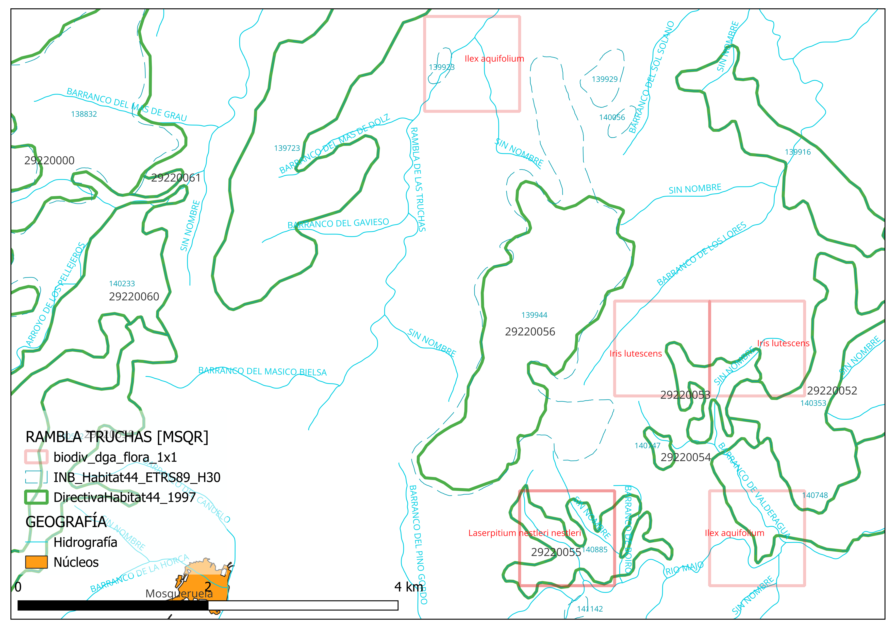

[29220056] Saturejo gracilis-Erinaceetum anthyllidis
[29220063] Junipero sabinae-Pinetum sylvestris
C:\Users\jesus\Downloads\CARTOGRAFÍA\directivadatos_44_tcm30-199566

## GEOGRAFÍA

La zona objeto de este análisis teórico de vegetación potencial -la [[Rambla de las Truchas]]- es un valle cuya cabecera está a las afueras de Mosqueruela, al NE, y discurre en esa dirección hasta convertirse en el Columbres, unirse al [[rio Cantavieja]] y desembocar en el [[río Bergantes]]. El paraje en concreto se reparte entre la zona de [[la Tejería]] -a cuyos pies está el Área Recreativa de las Truchas (1350 msnm) con un azud para mantener el caudal todo el año para los y dos molinos de las inmediaciones, aguas abajo- en su umbría, y [[la Burrea]] -cima o cabezo<ref>https://www.academia.edu/38118706/_1976_Toponimia_de_ra%C3%ADz_Bur_en_el_occidente_del_Arag%C3%B3n_Medio_un_punto_de_contacto_l%C3%A9xico_vasco_ib%C3%A9rico Toponimia de raíz Bur- en el occidente del Aragón Medio: un punto de contacto léxico vasco-ibérico, Juan Antonio Frago 1976, Fontes Linguae Vasconum, núm. 24, pp. 323-331.</ref>- y [[la Cingla]] de la ladera de solana, con una cota máxima de 1600 msnm.

## FLORA ([[Fitosociología]] y hábitats potenciales)
A priori se presentan dos tipos de hábitats:

1. 31.7412 Matorrales de erizón (Erinacea anthyllis) del Sistema Ibérico centro-meridional, en ocasiones con Genista rigidissima (BREZALES Y MATORRALES DE ZONA TEMPLADA)[https://mediambient.gva.es/estatico/vida-silvestre/manual-identificacion-habitats-protegidos-CV/MTB7%20Habitats%20Protegidos%20CV%20CASTELLANO%2004%20Brezales%20y%20matorrales%20de%20zona%20templada.pdf]<ref>HAB_LAY,C,9  CODHAB,C,12	NATURALIDA,N,19,11	PORCENTAJE,N,19,11	ALIANZA,C,254	SPSALIANZA,C,254	NOM_HABITA,C,254	NOM_COMUN,C,254	GENERICO,C,254	CODUE,C,254	PRIORITARI,C,254 DESCRIPCIO,C, 

139723 306043	2	62	Pino ibericae-Juniperion sabinae Rivas Goday ex Rivas Goday & Borja 1961 corr. Rivas-Martínez & J.A. Molina in Rivas-Martínez, Fernández-González & Loidi 1999	Pinus nigra subsp. mauretanica, Pinus sylvestris subsp. nevadensis, Pinus x rhaetica nothovar. borgiae, Saponaria glutinosa subsp. zapateri.	Junipero sabinae-Pinetum ibericae Rivas Goday & Borja 1961 corr. Rivas-Martínez, T.E. Díaz, Fernández-González, Izco, Loidi, Lousã & Penas 2002	Pinares de Pinus sylvestris y Juniperus sabina (matorrales)	Sabinares rastreros	4060	Np	Brezales alpinos y boreales</ref>

2. 42.5A21 Pinares de Pinus sylvestris con sotobosque
de Juniperus sabina (ibidem), del Sistema Ibérico con todas sus variaciones a prospectar <ref>139944 309088	1	75	Sideritido incanae-Salvion lavandulifoliae (Rivas Goday & Rivas-Martínez 1969) Izco & A. Molina 1989	Astragalus clusianus, Astragalus turolensis, Dianthus algetanus subsp. algetanus, Hippocrepis commutata, Knautia subscaposa, Linum suffruticosum subsp. differens, Salvia lavandulifolia subsp. lavandulifolia, Salvia phlomoides subsp. phlomoides, Satureja	Saturejo gracilis-Erinaceetum anthyllidis Rivas Goday & Borja 1961 corr. Izco & A. Molina 1989	Matorrales supra-oromediterráneos subhúmedos maestracenses de Erinacea anthyllis	Matorrales pulviniformes	4090	Np	Brezales oromediterráneos endémicos con aliaga	

139944	306043	2	5	Pino ibericae-Juniperion sabinae Rivas Goday ex Rivas Goday & Borja 1961 corr. Rivas-Martínez & J.A. Molina in Rivas-Martínez, Fernández-González & Loidi 1999	Pinus nigra subsp. mauretanica, Pinus sylvestris subsp. nevadensis, Pinus x rhaetica nothovar. borgiae, Saponaria glutinosa subsp. zapateri.	Junipero sabinae-Pinetum ibericae Rivas Goday & Borja 1961 corr. Rivas-Martínez, T.E. Díaz, Fernández-González, Izco, Loidi, Lousã & Penas 2002	Pinares de Pinus sylvestris y Juniperus sabina (matorrales)	Sabinares rastreros	4060	Np	Brezales alpinos y boreales [Atlas y Manual de los Hábitats Naturales y Seminaturales de España, 2005](https://www.miteco.gob.es/es/biodiversidad/servicios/banco-datos-naturaleza/informacion-disponible/index_atlas_manual_habitats.html)<ref>
Todo ello se resume en una misma serie: pinares y enebrales calcícolas oromediterráneos en diversos grados de regresión.

3. 139923	215050	1	5	Potamion (Koch 1926) Libbert 1931	Potamogeton alpinus, Potamogeton gramineus, Potamogeton praelongus, Potamogeton trichoides.	Potamion (Koch 1926) Libbert 1931	Comunidades dulceacuícolas de elodeidos	Vegetación hidrofítica	3150	Np	Lagos eutróficos naturales con vegetación Magnopotamion o Hydrocharition
139923	621030	1	80	Glycerio-Sparganion Br.-Bl. & Sissingh in Boer 1942	Antinoria agrostidea subsp. agrostidea, Eleocharis palustris subsp. palustris, Myosotis caespitosa, Oenanthe fistulosa, Oenanthe globulosa, Ranunculus ophioglossifolius, Sparganium erectum subsp. neglectum.	Glycerio-Sparganion Br.-Bl. & Sissingh in Boer 1942	Esparganiales	Esparganiales [ibidem]

### TABLA 16 ETAPAS DE REGRESIÓN Y BIOINDICADORES. SERIES 14a, 14b.  (Fb. PINARES, ENEBRALES Y SABINARES CALCÍCOLAS OROMEDITERRÁNEOS)

|| Serie 14a. Maestrazgo-conquense de la sabina rastrera | Serie 14b. Bética de la sabina rastrera |
|-------|------------------------------------------------------|------------------------------------------|
| *Nombre fitosociológico* | **Sabino-Pineto sylvestris sigmetum** | **Daphno oleoidi-Pineto sylvestris sigmetum** |
|*Árbol dominante*  | **Pinus sylvestris** | **Pinus sylvestris** |

| **I. Bosque** | *Pinus sylvestris* | *Pinus sylvestris* |
| | *Pinus uncinata* | *Pinus clusiana*  |
| | *Juniperus sabina *| *Daphne oleoides* |
| | *Rosa sicula* | *Geum heterocarpum* |

| **II. Matorral denso** | *Juniperus sabina* | *Juniperus sabina* |
| | *Juniperus hemisphaerica* | *Juniperus hemisphaerica* |
| | *Berberis seroi*[sic] | *Berberis hispanica* |
| | *Ononis aragonensis* | *Polygala boisseri*|

| **III. Matorral degradado** | *Thymus godayanus* | *Vella spinosa* |
| | *Erinacea anthyllis* | *Erinacea anthyllis* |
| | *Sideritis pulvinata* | *Satureja prostata* |
| | *Erodium celtibericum* | *Pterocephalus spathulatus* |

| **IV. Pastizales** | *Festuca hystrix* | *Festuca hystrix* |
| | *Ononis cenisia* | *Thymus granatensis * |
| | *Astragalus austriacus* | *Poa flaccidula* |

---
Fuente: Memoria del mapa de series de vegetación de España, Rivas-Martínez, Salvador ICONA, 1987 ISBN 84-85496-25-6, página 99

(BREZALES Y MATORRALES DE ZONA TEMPLADA)[https://mediambient.gva.es/estatico/vida-silvestre/manual-identificacion-habitats-protegidos-CV/MTB7%20Habitats%20Protegidos%20CV%20CASTELLANO%2004%20Brezales%20y%20matorrales%20de%20zona%20templada.pdf]
