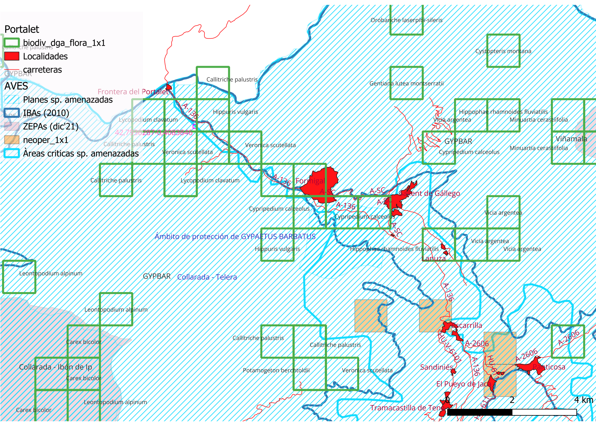

`Petitio notitia`

A/A Jefe del Servicio de Conservación de la Biodiversidad  
Dirección General de Medio Natural 
Departamento de Medio Ambiente  y Turismo 
Plaza de San Pedro Nolasco, 7 
50071 Zaragoza (Zaragoza)

Zaragoza, 2 de junio de 2025

# ASUNTO | SOLICITUD DE INFORMACIÓN AMBIENTAL DE LAS OBRAS QUE SE REALIZAN EN PORTALET (TM de Sallént de Gállego) 

Luis Tirado Blázquez, mayor de edad, con D.N.I. nº 25163410-F, actuando en calidad de Delegado de la Sociedad Española de Ornitología (SEO/BirdLife) en Aragón, inscrita en el Registro de Asociaciones con el nº 3.943, y con domicilio a efectos de comunicación en, C/ La Rioja (Estación Zaragoza-Delicias), 50011 Zaragoza; 

## COMPARECE Y EXPONE

### PRIMERO. IMÁGENES SOBRE OBRAS REALIZADAS
En diversos medios y RSs se han publicado imágenes sobre trabajos de desmonte mediante excavadoras en las inmediaciones de la frontera con Francia, en  concreto en el Portalet, TM de Sallént de Gállego. Estas obra consisten en un desmonte unido a una pista que discurre en paralelo con el nacimiento del río Gállego y atraviesa varios manantiales y zonas húmedas.
C:\Users\jesus\OneDrive\Escritorio\SEO [Root]\Portalet [Prtl]\502471246_3942648035994662_8111156824985494677_n.jpg

### SEGUNDO. Afecciones ambientale
Estas obras se realizan dentro de un espacio natural declarado Important Bird Area [IBA][^1] por la presencia y nidificación de Milvus milvus, además de Lagopus muta. Además, éstas están dentro del área delimitada para la conservación del Quebrantahuesos[^2] además de ser área crítica del mismo. Está a un kilómetro del Parque Nacional de los Pirineos franceses. Finalmente,  tal y como se aprecia en el mapa adjunto, estas obras afectan a varias especies de flora catalogada. Todas ellas, ligadas a entornos húmedos.

### TERCERO.Información ambiental
Que esta información tiene carácter ambiental, según el artículo 2.3 de la Ley 27/2006, de 18 de julio, por la que se regulan los derechos de acceso a la información, de participación pública y de acceso a la justicia en materia de medio ambiente[^3] (incorpora las Directivas 2003/4/CE y 2003/35/CE) y más en concreto y en relación con este proyecto concurren las definiciones dadas en los párrafos del citado artículo:

    *3. Información ambiental: toda información en forma escrita, visual, sonora, electrónica o en cualquier otra forma que verse sobre las siguientes cuestiones:*
        
        *a) El estado de los elementos del medio ambiente, como el aire y la atmósfera, el agua, el suelo, la tierra, los paisajes y espacios naturales, incluidos los humedales y las zonas marinas y costeras, la diversidad biológica y sus componentes, incluidos los organismos modificados genéticamente; y la interacción entre estos elementos*

Por todo lo anterior,

## EJERCITA

El DERECHO DE ACCESO A LA INFORMACIÓN en materia de Medio Ambiente, en los términos establecidos en la citada Ley, 

SOLICITANDO que en el plazo máximo que dicta la Ley[^4], de un mes desde la recepción de la solicitud, se nos dé traslado:

- Copia del expediente o expedientes generados durante el procedimiento administrativo inciado y finalizado, con su autorización administrativa motivada, origen de las obras observadas

- Cuanta información complementaria o asociada a expediente nos pueda ser de utilidad en el marco del artículo 5 de la citada ley La Ley 27/2006[^5], de 18 de julio

OTROSÍ DIGO Que en el caso de que en la documentación solicitada existiese información que fuese motivo de excepción por verse afectado negativamente cualquier extremo, en aplicación del Artículo 13.2 de la Ley 27/2006, de 18 de julio, se justifiquen y motiven las razones concretas de dicha afección, proporcionando acceso al resto de la información, eliminando la información objeto de excepción dado que la información solicitada nos es imprescindible. 

Fdo:

Luis Tirado Blázquez
Delegado de SEO/BirdLife en Aragón

Zaragoza, 2 de junio de 2025

[^2]: DECRETO 45/2003, de 25 de febrero, del Gobierno de Aragón, por el que se establece un régimen de protección para el quebrantahuesos y se aprueba el Plan de Recuperación. BOA nº29 12/3/03

[^3]: Ley 27/2006, de 18 de julio, por la que se regulan los derechos de acceso a la información, de participación pública y de acceso a la justicia en materia de medio ambiente (incorpora las Directivas 2003/4/CE y 2003/35/CE). BOE núm. 171, de 19/07/2006

[^4]: La Ley 27/2006, de 18 de julio, en su artículo 10 establece el plazo máximo de un mes desde la recepción de la solicitud en el registro de la autoridad pública competente para resolver

[^5]:*b) Facilitar información para su correcto ejercicio, así como consejo y asesoramiento en la medida en que resulte posible. ... d) Garantizar que su personal asista al público cuando trate de acceder a la información ambiental. e) Fomentar el uso de tecnologías de la información y de las telecomunicaciones para facilitar el acceso a la información. f) Garantizar el principio de agilidad en la tramitación y resolución de las solicitudes de información ambiental*

[^1]: [IBA Collarada-Telera nº124](https://datazone.birdlife.org/site/factsheet/collaradatelera)

BirdLife International (2025) Site factsheet: Collarada - Telera. Downloaded from https://datazone.birdlife.org/site/factsheet/collaradatelera 30/05/2025

Scientific name
Common name
Red List category
Red List category year
Season
Year(s) of population estimate
Population
Units
Lagopus muta	Rock Ptarmigan	Least Concern	2016	Resident	2001	5-10	Breeding pairs	C6
**Milvus milvus**	Red Kite	Least Concern	2020	Resident	2009	min. 13	Breeding pairs	A1, C1
Aquí tienes la tabla sin las columnas de "Red List":

| Scientific name | Common name | Season | Year(s) of population estimate | Population | Units | Additional |
|---|---|---|---|---|---|---|
| Lagopus muta | Rock Ptarmigan | Resident | 2001 | 5-10 | Breeding pairs | C6 |
| **Milvus milvus** | Red Kite | Resident | 2009 | min. 13 | Breeding pairs | A1, C1 |