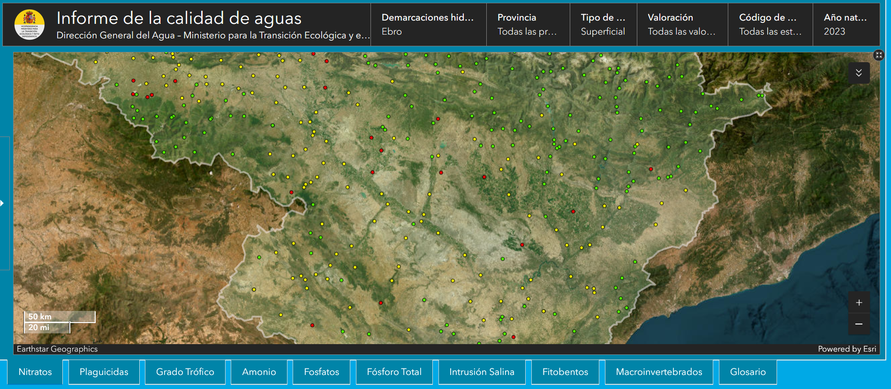
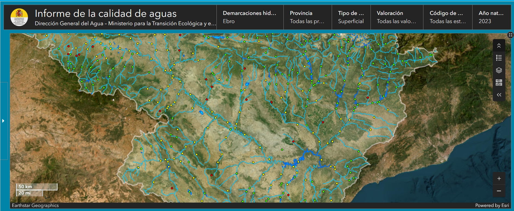

# [INFORME SOBRE CALIDAD DE LAS AGUAS 2010-2022](https://www.miteco.gob.es/content/dam/miteco/es/agua/temas/estado-y-calidad-de-las-aguas/informes-calidad-de-las-aguas/Informe-Calidad-Aguas-2010-2022.pdf) [ICA22]

*Ley 19/2013, de 9 de diciembre, de transparencia, acceso a la información pública y buen gobierno, amplía y refuerza estas obligaciones, especialmente las referentes a la publicidad activa. Así señala que la información sujeta a las obligaciones de transparencia será publicada en las correspondientes sedes electrónicas o páginas web y de una manera clara, estructurada y entendible para los interesados.*
*El artículo 8 de la Directiva 2000/60/CE, conocida como Directiva Marco del Agua*  
...
*artículo 92.ter del Real Decreto Legislativo 1/2001, de 20 de julio, por el que se aprueba el texto refundido de la Ley de Aguas* [ICA22:9] [Comprobar si se hizo transposición completa]

*control adicional de las zonas protegidas; las normas de calidad ambiental con objeto de conseguir un buen estado químico de las aguas superficiales; y las condiciones de referencia y los límites de clases de estado de los indicadores de los elementos de calidad biológicos, fisicoquímicos e hidromorfológicos para clasificar el estado o potencial ecológico de las masas de agua superficiales*[ICA22:10]

*Real Decreto 47/2022 de 18 de enero, sobre protección de las aguas contra la contaminación difusa producida por los nitratos procedentes de fuentes agrarias* INDICADORES FISICO-QUÍMICOS DE CALIDAD DE LAS AGUAS 4 [ICA22:17]

# Estaciones de muestreo
[Patrón de número de estaciones inversamente proporcional a los usos de agua y al caudal de los cursos o cuerpos de agua]
<!-->Search surface of Clamor Amarga in Zaragoza in square kilometers  and search square kilometers -and percentaje- of surface ocupped with crops and farms 
[ESTACIÓN 9225:  RIO CLAMOR AMARGA EN ZAIDIN](https://ceh.cedex.es/anuarioaforos/afo/estaf-datos.asp?indroea=9225) 785 km2</-->

## Río Gállego [EBR0453]
### Nitratos
Concentración	13,866667
Unidades	mg NO3/l
Valoración	> 5 - 25 mg/L NO3
Número analíticas	6
Número puntos de muestreo	1
Año natural	2023
Categoría	RW
UTMX	678505,000000
UTMY	4613295,000000
HUSO	30

### Plaguicidas
Valoración	> LQ y < Valor frontera
Número analíticas	465
Número puntos de muestreo	1
Año natural	2023
Categoría	RW
UTMX	680110
UTMY	4618041
HUSO	30

## Barranco de la Violada desde su nacimiento hasta su desembocadura en el río Gállego [EBR0120]

### Nitratos
Concentración	39,700000
Unidades	mg NO3/l
Valoración	> 25 mg/L NO3
Número analíticas	9
Número puntos de muestreo	1
Año natural	2023
Categoría	RW
UTMX	691113,000000
UTMY	4646885,000000
HUSO	30

### Plaguicidas
	
Valoración	> `Valor frontera`
Número analíticas	578
Número puntos de muestreo	1
Año natural	2023
Categoría	RW
UTMX	691113
UTMY	4646885
HUSO	30

## Río Gállego desde el barranco de la Violada hasta el azud de Urdán [EBR0817]
### Nitratos
	
Concentración	5,667059
Unidades	mg NO3/l
Valoración	> 5 - 25 mg/L NO3
Número analíticas	17
Número puntos de muestreo	2
Año natural	2023
Categoría	RW
UTMX	683605,000000
UTMY	4631950,000000
HUSO	30

### Plaguicidas
	
Valoración	> LQ y < Valor frontera
Número analíticas	505
Número puntos de muestreo	1
Año natural	2023
Categoría	RW
UTMX	683605
UTMY	4631950
HUSO	30

## Barranco de la Valcuerna desde su nacimiento hasta su entrada en el Embalse de Mequinenza [EBR0146]

### Nitratos
Concentración	97,770000
Unidades	mg NO3/l
Valoración	> 25 mg/L NO3
Número analíticas	10
Número puntos de muestreo	1
Año natural	2023
Categoría	RW
UTMX	747950,000000
UTMY	4599325,000000
HUSO	30

### Plaguicidas
Valoración	> `Valor frontera`
Número analíticas	576
Número puntos de muestreo	1
Año natural	2023
Categoría	RW
UTMX	747950
UTMY	4599325
HUSO	30

## Clamor Amarga desde su nacimiento hasta su desembocadura en el río Cinca [EBR0166]
### Nitratos
Concentración	34,818182
Unidades	mg NO3/l
Valoración	> 25 mg/L NO3
Número analíticas	11
Número puntos de muestreo	1
Año natural	2023
Categoría	RW
UTMX	782015,000000
UTMY	4623382,000000
HUSO	30

### Plaguicidas
Valoración	> `Valor frontera`
Número analíticas	578
Número puntos de muestreo	1
Año natural	2023
Categoría	RW
UTMX	782015
UTMY	4623382
HUSO	30

## Laguna de la Playa [EBL0989] 
### Nitratos
Concentración	0,296000
Unidades	mg NO3/l
Valoración	≤ 5 mg NO3/L
Número analíticas	4
Número puntos de muestreo	1
Año natural	2023
Categoría	LW
UTMX	734944,000000
UTMY	4589205,000000
HUSO	30

### Plaguicidas
Valoración	> `LQ` y < `Valor frontera`
Número analíticas	204
Número puntos de muestreo	1
Año natural	2023
Categoría	LW
UTMX	734944
UTMY	4589205
HUSO	30

## Huerva [EBR0821]
### Nitratos 
Concentración	51,354545
Unidades	mg NO3/l
Valoración	> 25 mg/L NO3
Número analíticas	11
Número puntos de muestreo	1
Año natural	2023
Categoría	RW
UTMX	652006,000000
UTMY	4556734,000000
HUSO	30

### Plaguicidas
aloración	> `Valor frontera`

Número analíticas	501
Número puntos de muestreo	1
Año natural	2023
Categoría	RW
UTMX	652006 Comprobar coordenadas
UTMY	4556734
HUSO	30

## Gallocanta [EBL0984]
### Nitratos 
Concentración	0,480325
Unidades	mg NO3/l
Valoración	≤ 5 mg NO3/L
Número analíticas	4
Número puntos de muestreo	1
Año natural	2023
Categoría	LW
UTMX	626181,000000
UTMY	4536507,000000
HUSO	30

### Plaguicidas
Valoración	> `Valor frontera`
Número analíticas	302
Número puntos de muestreo	2
Año natural	2023
Categoría	LW
UTMX	626181
UTMY	4536507
HUSO	30

# [Water Quality Data Trends 2010-2022](https://claude.site/artifacts/c8e8f4d7-4c56-4179-a990-e0e76d8a0ab8) [ICA22:26]
| AÑO | ≤ 5 mg/l | ≤ 25 mg/l | > 25 mg/l | Total | % >25 mg/l | Nº total analíticas |
|-----|-----------|------------|-----------|--------|------------|-------------------|
| 2010 | 2.236 | 1.082 | 194 | 3.512 | 5,52% | 12.824 |
| 2011 | 1.502 | 755 | 139 | 2.396 | 5,80% | 9.795 |
| 2012 | 1.926 | 895 | 169 | 2.990 | 5,65% | 11.587 |
| 2013 | 2.171 | 913 | 175 | 3.259 | 5,37% | 13.063 |
| 2014 | 2.181 | 999 | 173 | 3.353 | 5,16% | 14.144 |
| 2015 | 2.367 | 922 | 198 | 3.487 | 5,68% | 13.912 |
| 2016 | 2.284 | 942 | 163 | 3.389 | 4,81% | 12.560 |
| 2017 | 2.281 | 877 | 183 | 3.341 | 5,48% | 11.379 |
| 2018 | 2.323 | 1.049 | 202 | 3.574 | 5,65% | 13.614 |
| 2019 | 2.208 | 863 | 200 | 3.271 | 6,11% | 13.137 |
| 2020 | 1.945 | 956 | 218 | 3.119 | 6,99% | 17.908 |
| 2021 | 1.938 | 927 | 207 | 3.072 | 6,74% | 23.199 |
| 2022 | 2.008 | 954 | 176 | 3.138 | 5,61% | 21.442 |

# 4.2.- DETECCIÓN DE PLAGUICIDAS EN LAS AGUAS [ICA:29]

## REFERENCIAS
[NABIA](https://www.arcgis.com/apps/dashboards/469c05fa7fc848088d57cf0ed43fe9f8)
 

