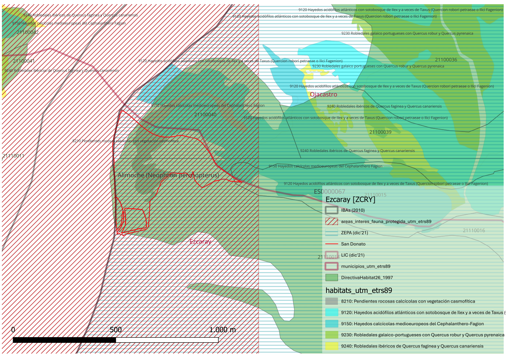

# GUION PARA DESARROLLO DE PERICIAL en contra DEL PROYECTO DE VÍA FERRATA EN SAN DONATO, EZCARAY ( La Rioja)

    
    Guía de estilo: normal, texto de informe; en cursiva, literales; negrita cursiva, importante del literal; sin formato, comentarios de autor; abreviaturas, las iniciales del documento citado al principio p. ej: Notificación Acuerdo Comisión Permanente 2024-08 [NACP:3]

## RESUMEN
- equipara Vía Ferrata [VF] con vía de escalada
- el VF es incompatible por fomento de afluencia de gente (perturbación) y reducción posible área cría `concepto de hábitat potencial para nidificación`
- 2 causas de nulidad posibles: documentación incompleta y desestimación recurso
- Se incurre en falsedad por declarar afección a 35 m2 `pte. proyecto`
- Afección a más especies catalogadas que las contempladas
- Discrepancia entre la categorización que hace el propio Gobierno de La Rioja del ZEC y lo declarado en NACP

## Análisis de contraste de documentación oficial y cronología (situación del proc. admin.)
`Hay que establecer en qué momento del proc. admin. se está, porque sólo se tiene este Acuerdo y faltaría autorización Ayto.`
    
*De acuerdo a la normativa del Plan de gestión y ordenación de los recursos naturales del espacio Red Natura 2000 “Sierras de Demanda, Urbión, Cebollera y Cameros” (Decreto 46/2022, de 17 de agosto) **se considera como autorizable la equipación de nuevas vías permanentes para la escalada deportiva o modificación y reposición de la existentes en roquedos y paredes donde ya existen vías abiertas en la fecha de aprobación de este Plan**”. La Vía Ferrata se proyecta en una pared incluida en la Escuela de Escalada de Ezcaray dentro del Sector Peña San Torcuato en el que existen 13 vías de escalada* NU2024-0053 EZCARAY Notificación Acuerdo Comisión Permanente 2024-08 [NACP:3]

La cuestión principal a rebatir es este párrafo -que se repite a lo largo del Acuerdo- que equipara Vía Ferrata [VF] con vía de escalada, cuando -como se verá- son instalaciones totalmente diferentes [ZCRYintro].

*Una vez realizada la correspondiente evaluación de repercusiones sobre el espacio incluido en la Red Natura 2000, se considera que **no es probable que el proyecto cause afecciones significativas sobre hábitats naturales ni taxones de interés comunitario, ni origine perjuicio a la integridad del espacio perteneciente a la Red Natura 2000** y que es compatible con los objetivos de conservación establecidos en su Plan de gestión y ordenación de los recursos naturales* Informe Dirección General de Medio Natural y Paisaje favorable con fecha 7 de agosto de 2024 [NACP:4]

Todos los informes se basan única y exclusivamente en las afecciones al alimoche ya existente en Ojacastro, cuando este nido dista de la Escuela de Escalada (x metros). Sin embargo, no se aborda en ningún momento dos cuestiones fundamentales:

- Afecciones al resto de especies catalogadas y existentes: buitre, halcón, real y chova

- Que elimina cualquier posibilidad de expansión de especies nidificantes rupícolas en la zona afectada por la VF, lo que entraría en clara contradicción con el Plan y la legislación vigente (Plan de Gestión y Ordenación de los Recursos Naturales del Espacio Protegido Red Natura 2000 “Sierras de Demanda, Urbión, Cebollera y Cameros”, Decreto 9/2014, de 21 de febrero, por el que se declaran las zonas especiales de conservación de la Red Natura 2000 en la Comunidad Autónoma de La Rioja y se aprueban sus planes de gestión y ordenación de los recursos naturales) [PGORN] `Buscar BOJA`

Además, queda por analizar en detalle la posible nulidad por no presentar la documentación en tiempo y forma:

*Conforme a la documentación presentada en julio de 2024 para solicitud de informe, el proyecto técnico **no incluía memoria ambiental según la Ley 6/2017, de 8 de mayo y el Decreto 29/2018, de 20 de septiembre** `Pendiente de ampliar`, no pudiéndose valorar si dicha actividad se encuentra afectada por la normativa referente a generación de residuos, emisiones y suelo, por lo que el promotor, en este caso el Ayuntamiento, deberá presentar un anexo al proyecto que incluya lo descrito en este informe, en caso de su tramitación como licencia ambiental.* [NACP:5]

*Se fijan a la pared mediante taco químico.*[NACP:6] `Posibles focos de vertido de tóxicos por lixiviado e infiltración` `Pendiente de ampliar`

*Dadas las características de la actuación, equipamiento fijo para la escalada, está categorizada como “Adecuación Naturalista” (artículo 24 e) de la Directriz de Protección del Suelo No Urbanizable en La Rioja (DPSNU) y en aplicación del artículo 42 del Plan Especial del Alto Oja y de lo establecido en la DPSNU será necesaria autorización de la Comisión de Ordenación del Territorio y Urbanismo siguiendo el procedimiento de autorización establecido en el artículo 53 de la Ley 5/2006, de 2 de mayo, de Ordenación del Territorio y Urbanismo de La Rioja*
[NACP:7]

*En el conjunto de los roquedos que conforman la Peña San Torcuato anidan un total de 20 parejas de buitre leonado y una pareja de halcón peregrino. Estos nidos se localizan fundamentalmente en la parte de la Peña que afecta al término municipal de Ojacastro* [NACP:7] No se contempla la presencia de Chova piquirroja ni águila real, como sí se hace en el  [Plan de Gestión y Ordenación de los Recursos Naturales del espacio protegido Red Natura 2000 “Sierras de Demanda, Urbión, Cebollera y Cameros” 2022-2028](https://www.larioja.org/larioja-client/cm/medio-ambiente/images?idMmedia=1474353)

*3.- EVALUACIÓN DE REPERCUSIONES AMBIENTALES SOBRE ESPACIOS PROTEGIDOS RED NATURA 2000 Teniendo en cuenta la información existente sobre la Escuela de Escalada de Ezcaray se considera que la vía ferrata de desarrolla dentro del sector San Torcuato, que cuenta con 13 vías de escalada, por lo que se trata de una actuación autorizable. Una vez realizada la correspondiente evaluación de repercusiones ambientales sobre el espacio protegido de la Red Natura 2000 “Sierras de Demanda, Urbión, Cebollera y Cameros”, se considera que no es probable que cause afecciones significativas sobre hábitats naturales ni taxones de interés comunitario, ni origine perjuicio a la integridad de los espacios pertenecientes a la Red Natura 2000, y que es compatible con los objetivos de conservación establecidos en su Plan de gestión y ordenación delos recursos naturales* `pendiente referencia`

`No guarda relación con la categorización que hace el propio Gobierno de La Rioja`
 [Zonificación de los espacios protegidos Red Natura 2000](https://www.iderioja.larioja.org/vct/index.php?c=47496a336776647131624c53664b347253372b7457413d3d)`

*Por todo lo cual, en aplicación de los artículos 53 a 56 de la Ley 2/2023, de 31 de enero, de biodiversidad y patrimonio natural de La Rioja y del **Artículo 6 de la Directiva 92/43/CEE** del Consejo, de 21 de mayo de 1992*[NACP:10] `Pendiente de ampliar`

El promotor deberá instalar la señalización y dispositivos necesarios para restringir el uso de estos equipamientos en la época restringida.[NACP:10] `Esto no es garantía de evitación de acceso, toda vez que no están definidos y se deja a futuro`

*TERCERO.- El uso que se pretende se encuentra englobado dentro del apartado 51.2.d), “Actividades y servicios de carácter cultural, … así como instalaciones deportivas, recreativas y de ocio.”, de la Ley 5/2006, de 2 de mayo, de Ordenación del Territorio y Urbanismo de La Rioja* [NACP:12] `Pendiente de ampliar`

*ACUERDO*
*...*
**Contra dicho acto de trámite, no cabe interponer recurso porque no pone fin al procedimiento administrativo, ni impide la continuación de éste, ni da lugar a indefensión.**[NACP:13] `Pendiente de ampliar. Si esto fuera así, no se podría recurrir DIAs, enmarcadas dentro de un proc. admin. de autorización de terceros. Otra causa de nulidad`

## Estudio de incidencia ambiental de la Vía Ferrata en San Torcuato, Ezcaray

- Descripción física de la zona afectada `estilo wikipedia` y figuras de protección 

Plano de distribución de los hábitats afectados según Gobierno de la Rioja `pendiente link`, MITECO [DirectivaHabitat26_1997](https://www.miteco.gob.es/es/biodiversidad/servicios/banco-datos-naturaleza/informacion-disponible/habitat_descargas_2.html#26-la-rioja) donde se contemplan más Hábitats de Interés Comunitario [HIC] que los declarados por el Gobierno de La Rioja:
CODHABITAT,C,15	| CODIGO_UE,C,4	| CONCEPTO,C,254 | PRIORITARI,C,1 | INDNATURAL,C,1 | COBERTURA,N,19,11 | TIPO_COBER,C,1 | CODIGO,C,8

- 309051	4090	+Arctostaphylo crassifoliae-Genistetum occidentalis+ Rivas-Martínez, T.E. Díaz, Fernández Prieto, Loidi & Penas 1984 2 70 	21110014	

- 824011	9240	+Cephalanthero rubrae-Quercetum fagineae+ Rivas-Martínez in Rivas Goday & cols. 1960 corr. 1972	2 30 21110014	Fuente: ibidem
															
- Superficie afectada (`discrepancia con 35 m2 declarados`)

- Hábitats afectados (1/4 del HIC 8210) [Fornós, J. J., Gómez-Pujol, L. & Balaguer, P., 2009. 8210 Pendientes rocosas calcícolas con vegetación casmofítica. En: VV.AA., Bases ecológicas preliminares para la conservación de los tipos de hábitat de interés comunitario en España. Madrid: Ministerio de Medio Ambiente, y Medio Rural y Marino. 42 p.](https://www.miteco.gob.es/content/dam/miteco/es/biodiversidad/temas/espacios-protegidos/8210_tcm30-196873.pdf)

- Fauna afectada
    · Situación -y evolución previsible- de las poblaciones de alimoche, buitre, halcón y chova
    · Aumento inducido de turismo `búsqueda bibliográfica` como amenaza para la conservación de los hábitats y la avifauna
    · Otra avifauna catalogada (trabajo de campo) [E-bird. Ezcaray, La Rioja. Lista de aves](https://ebird.org/hotspot/L9537794/bird-list)

