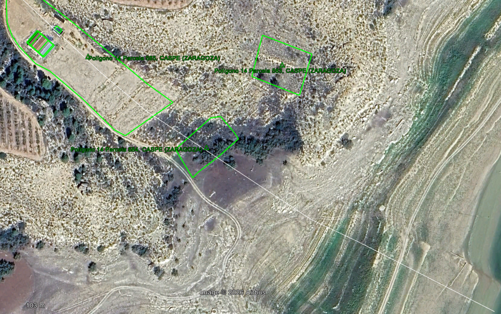

`[Csp][Botanic].md`
<!--~~Cabecera ejemplo BORRADOR ANÁLISIS ADMINISTRATIVO DEL CASO DEL RÍO OSIA~~ · SEO / BIRDLIFE · [Csp][Botanic].md · Versión 093002022026-->

# Propuesta de revegetado de zonas degradadas en el embalse de Mequinenza (TM Caspe)

## Intro
Se plantea la necesidad de revegetar tres parcelas -parcelas 583, 584 y 585 del Polígono 14; 1000, 1000 y 5000 m2 respectivamente- en la orilla este del Embalse de Mequinenza, frente a la isla Mediana, TM de Caspe. A vista de satélite que las parcelas se ubican a diferentes cotas sobre el nivel variable del embalse pero se puede concluir que:

- **585** es la que está a mayor cota y presenta un estado de degradación notable.

- **583** es un terreno a media ladera con algunos pinos carrascos y vegetación típica de la zona que pudiera corresponderse con Gypsophiletalia, dado el escaso nivel de recubrimiento de la vegetación sobre el suelo desnudo. `informe valdurrios`

- **584** es la que presenta mayor grado de conservación al estar en zona de inundación casi de forma permanente y presenta un soto de tamarices.

## PROPUESTAS DE REVEGETADO
Dadas las diferentes características de terrenos y su estado de conservación tan dispar, se proponen soluciones de revegetación adaptadas.

### 585
En esta parcela debería primarse el incremento de sombra, mediante la plantación -en lado sur y oeste- de pinos carrascos (*Pinus halepensis*) de forma discontinua y en la caras más favorables de proyección de sombra, rodales de coscoja y lentiscos, alternándose.

En caso de posibilidad de algo de riego, algún almez (*Celtis australis*) y olivilla (*Phillyrea angustifolia*).

En cuanto a herbáceas; un ligero labrado y siembra de lastón, alternando con ahoyado para romero, tomillo y globularia.

### 583
Ampliar el número de ejemplares de pinos pero sólo 2-3. Sabina negra (6-8 ej.), espino negro (6-8), romero y tomillo.

### 584
Aquí se podría ampliar los ejemplares de tamariz, pero a costa de efectuar poda de los existentes y plantación de zarzas...

